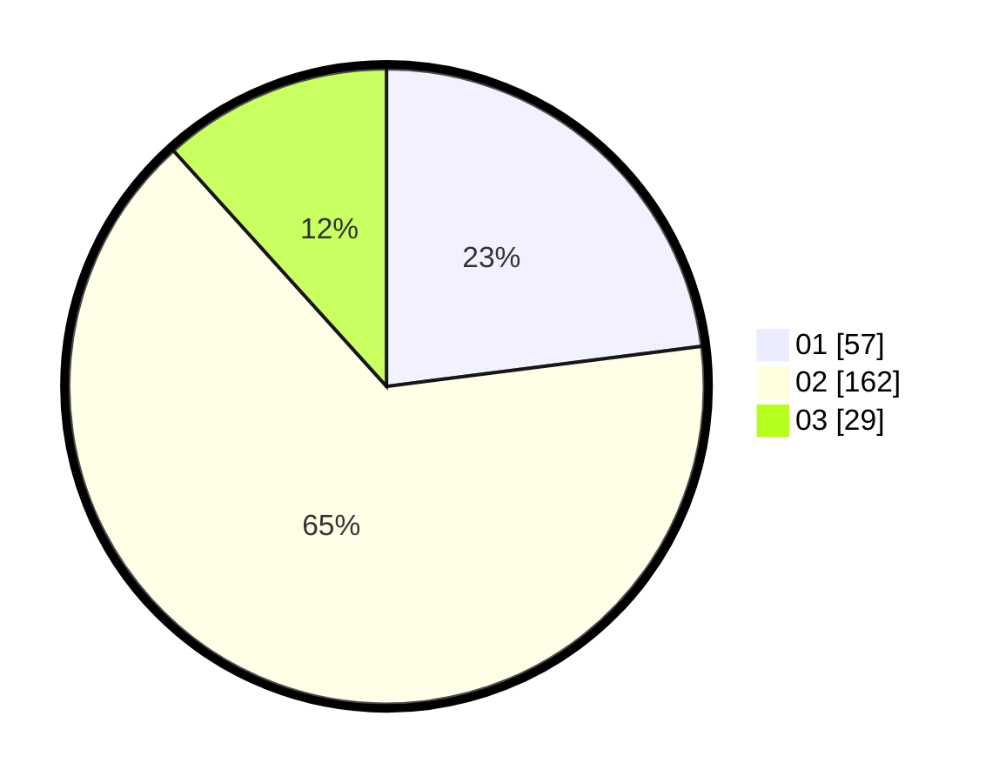

# Hasil

Hasil perolehan suara paslon dapat dilihat pada file paslon-01.txt, paslon-02.txt, dan paslon-03.txt.

Jika tidak ada, artinya data tersebut belum ada pada SIREKAP.

## Perolehan Suara

 * Paslon 01: **57**.
 * Paslon 02: **162**.
 * Paslon 03: **29**.

## Foto C Plano

https://sirekap-obj-formc.kpu.go.id/47f8/pemilu/ppwp/31/71/05/10/03/3171051003913-20240216-175847--5b35fd20-24a1-44cf-bc8f-337eb0d2a3a5.jpg

https://sirekap-obj-formc.kpu.go.id/47f8/pemilu/ppwp/31/71/05/10/03/3171051003913-20240216-175848--cb7d6760-f231-48cc-baa5-f4cc57b04013.jpg

https://sirekap-obj-formc.kpu.go.id/47f8/pemilu/ppwp/31/71/05/10/03/3171051003913-20240216-175848--25e041ac-fe6b-47a1-8101-780f10d31afc.jpg

## DATA PEMILIH TETAP

Jumlah pemilih dalam DPT: **289**.
 * L: **289**.
 * P: **0**.

## DATA PENGGUNA HAK PILIH

Jumlah pengguna hak pilih dalam DPT: **127**.
 * L: **127**.
 * P: **0**.

Jumlah pengguna hak pilih dalam DPTb: **130**.
 * L: **118**.
 * P: **12**.

Jumlah pengguna hak pilih dalam DPK: **0**.
 * L: **0**.
 * P: **0**.

Jumlah pengguna hak pilih: **257**.
 * L: **245**.
 * P: **12**.

## JUMLAH SUARA SAH DAN TIDAK SAH

JUMLAH SELURUH SUARA SAH: **248**.

JUMLAH SUARA TIDAK SAH: **9**.

JUMLAH SELURUH SUARA SAH DAN SUARA TIDAK SAH: **257**.
