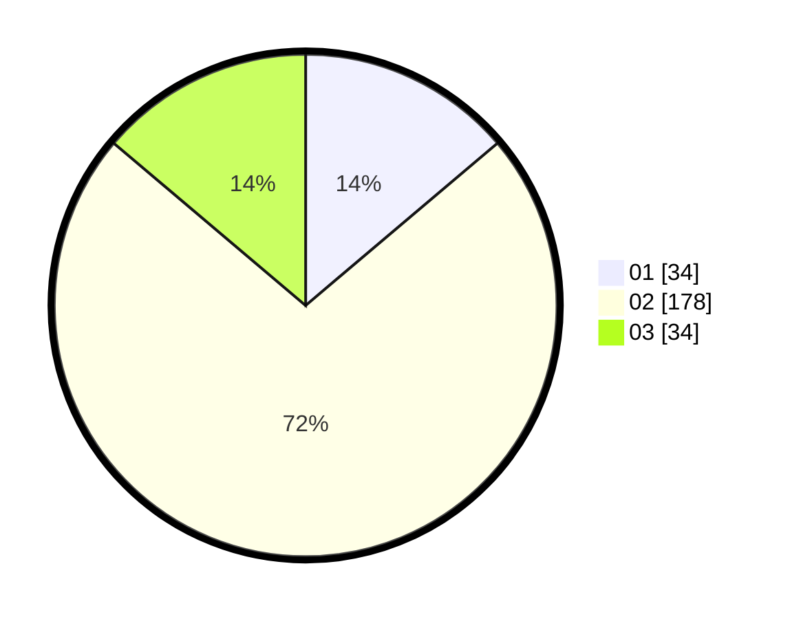

# Hasil

Hasil perolehan suara paslon dapat dilihat pada file paslon-01.txt, paslon-02.txt, dan paslon-03.txt.

Jika tidak ada, artinya data tersebut belum ada pada SIREKAP.

## Perolehan Suara

 * Paslon 01: **34**.
 * Paslon 02: **178**.
 * Paslon 03: **34**.

## Foto C Plano

https://sirekap-obj-formc.kpu.go.id/f5a2/pemilu/ppwp/31/71/05/10/03/3171051003914-20240216-015143--e755f7a3-664f-42ea-8798-c4780cc28020.jpg

https://sirekap-obj-formc.kpu.go.id/f5a2/pemilu/ppwp/31/71/05/10/03/3171051003914-20240216-015144--247deecf-c855-4f9d-8c19-dc881428d31c.jpg

https://sirekap-obj-formc.kpu.go.id/f5a2/pemilu/ppwp/31/71/05/10/03/3171051003914-20240216-015143--d461d90a-9cd8-4da4-999e-fcce06c75ce6.jpg

## DATA PEMILIH TETAP

Jumlah pemilih dalam DPT: **291**.
 * L: **291**.
 * P: **0**.

## DATA PENGGUNA HAK PILIH

Jumlah pengguna hak pilih dalam DPT: **240**.
 * L: **240**.
 * P: **0**.

Jumlah pengguna hak pilih dalam DPTb: **8**.
 * L: **7**.
 * P: **1**.

Jumlah pengguna hak pilih dalam DPK: **0**.
 * L: **0**.
 * P: **0**.

Jumlah pengguna hak pilih: **248**.
 * L: **247**.
 * P: **1**.

## JUMLAH SUARA SAH DAN TIDAK SAH

JUMLAH SELURUH SUARA SAH: **246**.

JUMLAH SUARA TIDAK SAH: **2**.

JUMLAH SELURUH SUARA SAH DAN SUARA TIDAK SAH: **248**.
