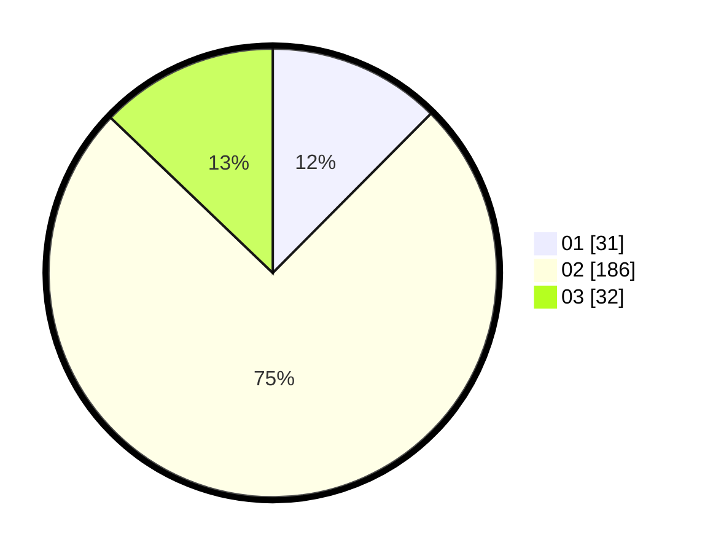

# Hasil

Hasil perolehan suara paslon dapat dilihat pada file paslon-01.txt, paslon-02.txt, dan paslon-03.txt.

Jika tidak ada, artinya data tersebut belum ada pada SIREKAP.

## Perolehan Suara

 * Paslon 01: **31**.
 * Paslon 02: **186**.
 * Paslon 03: **32**.

## Foto C Plano

https://sirekap-obj-formc.kpu.go.id/89d6/pemilu/ppwp/31/71/05/10/03/3171051003915-20240216-133453--ea641977-84dd-4487-a332-1a87e23af3b0.jpg

https://sirekap-obj-formc.kpu.go.id/89d6/pemilu/ppwp/31/71/05/10/03/3171051003915-20240216-133455--1f6a9609-b04a-4651-b8b2-582596c6645c.jpg

https://sirekap-obj-formc.kpu.go.id/89d6/pemilu/ppwp/31/71/05/10/03/3171051003915-20240216-133454--e486c7f3-2b69-414f-aad9-cf106fe1f281.jpg

## DATA PEMILIH TETAP

Jumlah pemilih dalam DPT: **281**.
 * L: **280**.
 * P: **1**.

## DATA PENGGUNA HAK PILIH

Jumlah pengguna hak pilih dalam DPT: **245**.
 * L: **245**.
 * P: **0**.

Jumlah pengguna hak pilih dalam DPTb: **9**.
 * L: **8**.
 * P: **1**.

Jumlah pengguna hak pilih dalam DPK: **0**.
 * L: **0**.
 * P: **0**.

Jumlah pengguna hak pilih: **254**.
 * L: **253**.
 * P: **1**.

## JUMLAH SUARA SAH DAN TIDAK SAH

JUMLAH SELURUH SUARA SAH: **249**.

JUMLAH SUARA TIDAK SAH: **5**.

JUMLAH SELURUH SUARA SAH DAN SUARA TIDAK SAH: **254**.
