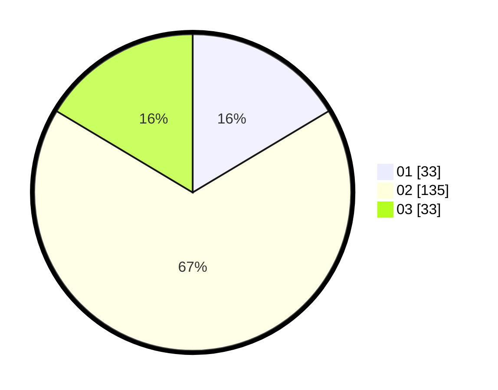

# Hasil

Hasil perolehan suara paslon dapat dilihat pada file paslon-01.txt, paslon-02.txt, dan paslon-03.txt.

Jika tidak ada, artinya data tersebut belum ada pada SIREKAP.

## Perolehan Suara

 * Paslon 01: **33**.
 * Paslon 02: **135**.
 * Paslon 03: **33**.

## Foto C Plano

https://sirekap-obj-formc.kpu.go.id/fe96/pemilu/ppwp/31/71/05/10/03/3171051003918-20240216-005238--fc87a847-2d46-42bc-b212-ac6629e75ddf.jpg

https://sirekap-obj-formc.kpu.go.id/fe96/pemilu/ppwp/31/71/05/10/03/3171051003918-20240216-005250--abbca86a-0185-473e-b2e2-671e63b0ee53.jpg

https://sirekap-obj-formc.kpu.go.id/fe96/pemilu/ppwp/31/71/05/10/03/3171051003918-20240216-005244--29086c0b-418c-440b-8f1c-894db0df6359.jpg

## DATA PEMILIH TETAP

Jumlah pemilih dalam DPT: **251**.
 * L: **250**.
 * P: **1**.

## DATA PENGGUNA HAK PILIH

Jumlah pengguna hak pilih dalam DPT: **97**.
 * L: **97**.
 * P: **0**.

Jumlah pengguna hak pilih dalam DPTb: **109**.
 * L: **108**.
 * P: **1**.

Jumlah pengguna hak pilih dalam DPK: **0**.
 * L: **0**.
 * P: **0**.

Jumlah pengguna hak pilih: **206**.
 * L: **205**.
 * P: **1**.

## JUMLAH SUARA SAH DAN TIDAK SAH

JUMLAH SELURUH SUARA SAH: **201**.

JUMLAH SUARA TIDAK SAH: **5**.

JUMLAH SELURUH SUARA SAH DAN SUARA TIDAK SAH: **206**.
