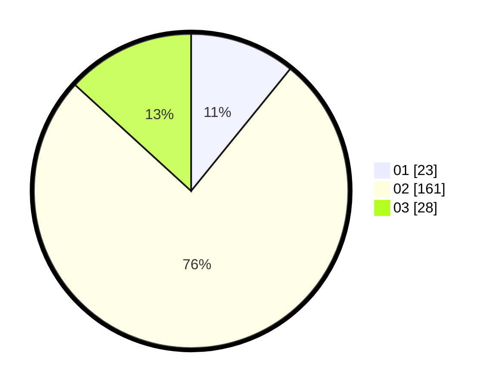

# Hasil

Hasil perolehan suara paslon dapat dilihat pada file paslon-01.txt, paslon-02.txt, dan paslon-03.txt.

Jika tidak ada, artinya data tersebut belum ada pada SIREKAP.

## Perolehan Suara

 * Paslon 01: **23**.
 * Paslon 02: **161**.
 * Paslon 03: **28**.

## Foto C Plano

https://sirekap-obj-formc.kpu.go.id/cb6a/pemilu/ppwp/31/71/05/10/03/3171051003919-20240216-003537--159ecc35-c299-42eb-8c4c-39951ecc3dd0.jpg

https://sirekap-obj-formc.kpu.go.id/cb6a/pemilu/ppwp/31/71/05/10/03/3171051003919-20240216-003542--6dc4c18e-3239-444c-9174-f553c24389c9.jpg

https://sirekap-obj-formc.kpu.go.id/cb6a/pemilu/ppwp/31/71/05/10/03/3171051003919-20240216-003538--79502ade-9ebe-43fd-a344-f13abdd4b7a2.jpg

## DATA PEMILIH TETAP

Jumlah pemilih dalam DPT: **289**.
 * L: **287**.
 * P: **2**.

## DATA PENGGUNA HAK PILIH

Jumlah pengguna hak pilih dalam DPT: **112**.
 * L: **112**.
 * P: **0**.

Jumlah pengguna hak pilih dalam DPTb: **102**.
 * L: **101**.
 * P: **1**.

Jumlah pengguna hak pilih dalam DPK: **0**.
 * L: **0**.
 * P: **0**.

Jumlah pengguna hak pilih: **214**.
 * L: **213**.
 * P: **1**.

## JUMLAH SUARA SAH DAN TIDAK SAH

JUMLAH SELURUH SUARA SAH: **212**.

JUMLAH SUARA TIDAK SAH: **2**.

JUMLAH SELURUH SUARA SAH DAN SUARA TIDAK SAH: **214**.
