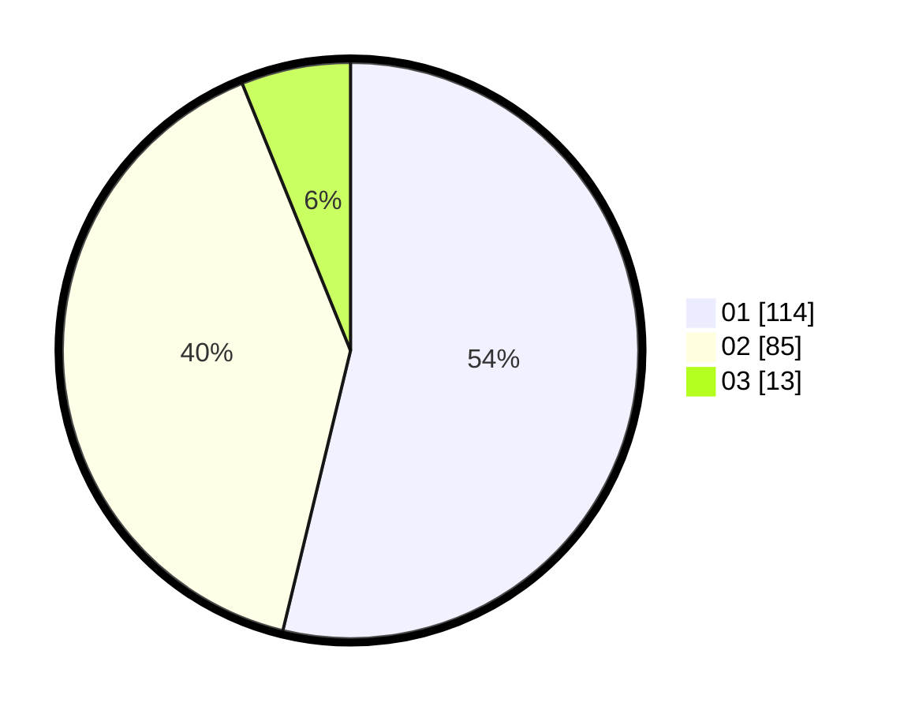

# Hasil

Hasil perolehan suara paslon dapat dilihat pada file paslon-01.txt, paslon-02.txt, dan paslon-03.txt.

Jika tidak ada, artinya data tersebut belum ada pada SIREKAP.

## Perolehan Suara

 * Paslon 01: **114**.
 * Paslon 02: **85**.
 * Paslon 03: **13**.

## Foto C Plano

https://sirekap-obj-formc.kpu.go.id/c8f0/pemilu/ppwp/31/71/06/10/01/3171061001003-20240215-204447--27d8fcaa-6f5e-4342-aa49-e348c807e489.jpg

https://sirekap-obj-formc.kpu.go.id/c8f0/pemilu/ppwp/31/71/06/10/01/3171061001003-20240215-204449--766fac0b-7ab5-4019-a2b1-a7bcf64bf69a.jpg

https://sirekap-obj-formc.kpu.go.id/c8f0/pemilu/ppwp/31/71/06/10/01/3171061001003-20240215-204448--b6eb284e-7ed4-4b03-8575-2dcc7cf31536.jpg

## DATA PEMILIH TETAP

Jumlah pemilih dalam DPT: **268**.
 * L: **133**.
 * P: **135**.

## DATA PENGGUNA HAK PILIH

Jumlah pengguna hak pilih dalam DPT: **215**.
 * L: **101**.
 * P: **114**.

Jumlah pengguna hak pilih dalam DPTb: **1**.
 * L: **1**.
 * P: **0**.

Jumlah pengguna hak pilih dalam DPK: **0**.
 * L: **0**.
 * P: **0**.

Jumlah pengguna hak pilih: **216**.
 * L: **102**.
 * P: **114**.

## JUMLAH SUARA SAH DAN TIDAK SAH

JUMLAH SELURUH SUARA SAH: **212**.

JUMLAH SUARA TIDAK SAH: **4**.

JUMLAH SELURUH SUARA SAH DAN SUARA TIDAK SAH: **216**.
