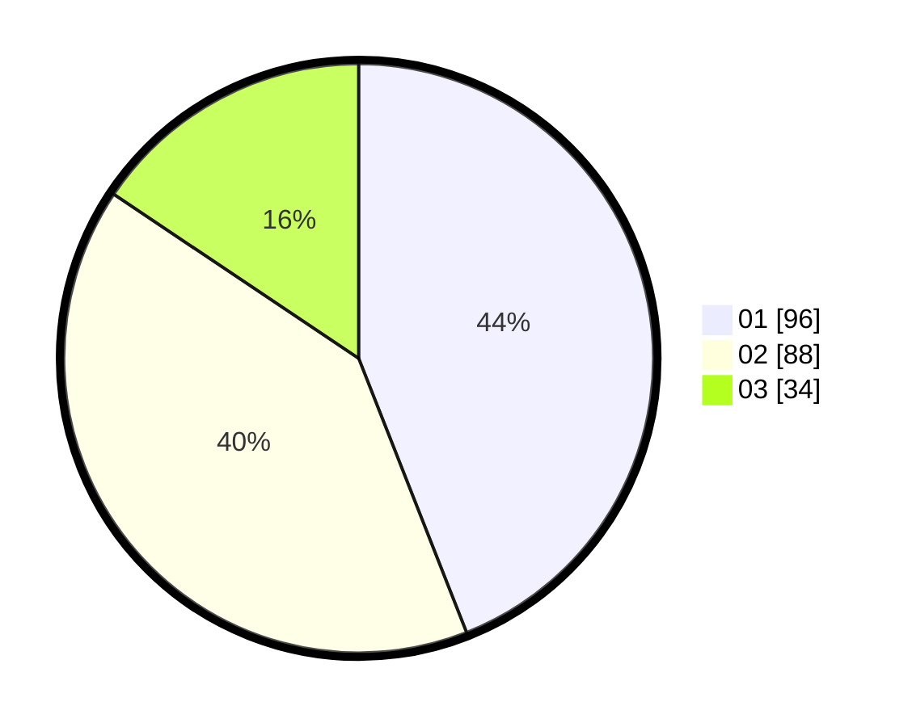

# Hasil

Hasil perolehan suara paslon dapat dilihat pada file paslon-01.txt, paslon-02.txt, dan paslon-03.txt.

Jika tidak ada, artinya data tersebut belum ada pada SIREKAP.

## Perolehan Suara

 * Paslon 01: **96**.
 * Paslon 02: **88**.
 * Paslon 03: **34**.

## Foto C Plano

https://sirekap-obj-formc.kpu.go.id/94a9/pemilu/ppwp/31/71/06/10/01/3171061001004-20240218-215509--f8a249da-b84e-4cb1-8a9d-3a9ec1a23ac0.jpg

https://sirekap-obj-formc.kpu.go.id/94a9/pemilu/ppwp/31/71/06/10/01/3171061001004-20240216-162324--54fa94ce-7a07-4683-9cc2-bf060bc4e2cb.jpg

https://sirekap-obj-formc.kpu.go.id/94a9/pemilu/ppwp/31/71/06/10/01/3171061001004-20240218-215721--1fdca629-c325-4907-94ab-0253e14169ba.jpg

## DATA PEMILIH TETAP

Jumlah pemilih dalam DPT: **270**.
 * L: **141**.
 * P: **129**.

## DATA PENGGUNA HAK PILIH

Jumlah pengguna hak pilih dalam DPT: **223**.
 * L: **109**.
 * P: **114**.

Jumlah pengguna hak pilih dalam DPTb: **2**.
 * L: **1**.
 * P: **1**.

Jumlah pengguna hak pilih dalam DPK: **0**.
 * L: **0**.
 * P: **0**.

Jumlah pengguna hak pilih: **225**.
 * L: **117**.
 * P: **115**.

## JUMLAH SUARA SAH DAN TIDAK SAH

JUMLAH SELURUH SUARA SAH: **218**.

JUMLAH SUARA TIDAK SAH: **7**.

JUMLAH SELURUH SUARA SAH DAN SUARA TIDAK SAH: **225**.
