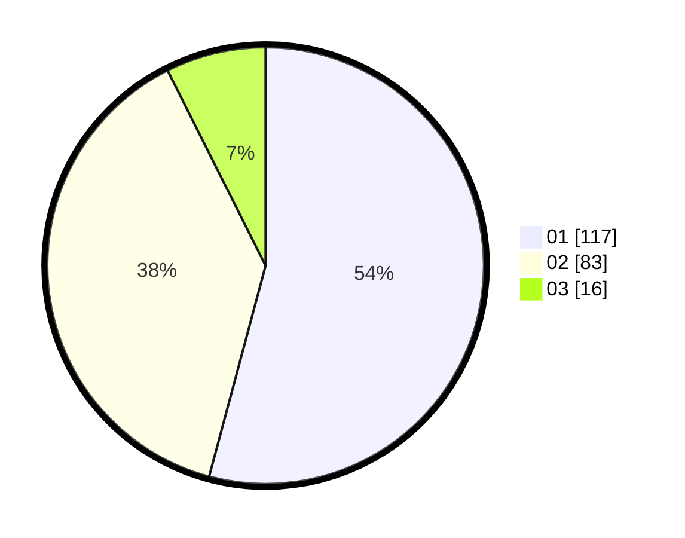

# Hasil

Hasil perolehan suara paslon dapat dilihat pada file paslon-01.txt, paslon-02.txt, dan paslon-03.txt.

Jika tidak ada, artinya data tersebut belum ada pada SIREKAP.

## Perolehan Suara

 * Paslon 01: **117**.
 * Paslon 02: **83**.
 * Paslon 03: **16**.

## Foto C Plano

https://sirekap-obj-formc.kpu.go.id/8380/pemilu/ppwp/31/71/06/10/01/3171061001010-20240216-063754--8cd289b9-e3c5-4d9b-bfc7-9aab313b2838.jpg

https://sirekap-obj-formc.kpu.go.id/8380/pemilu/ppwp/31/71/06/10/01/3171061001010-20240216-063756--744eb029-864f-41ab-acdc-43e954b070ec.jpg

https://sirekap-obj-formc.kpu.go.id/8380/pemilu/ppwp/31/71/06/10/01/3171061001010-20240216-063755--d182b81a-d9e9-471c-9356-2ef42aa9148b.jpg

## DATA PEMILIH TETAP

Jumlah pemilih dalam DPT: **271**.
 * L: **127**.
 * P: **144**.

## DATA PENGGUNA HAK PILIH

Jumlah pengguna hak pilih dalam DPT: **211**.
 * L: **90**.
 * P: **121**.

Jumlah pengguna hak pilih dalam DPTb: **0**.
 * L: **0**.
 * P: **0**.

Jumlah pengguna hak pilih dalam DPK: **6**.
 * L: **4**.
 * P: **2**.

Jumlah pengguna hak pilih: **217**.
 * L: **94**.
 * P: **123**.

## JUMLAH SUARA SAH DAN TIDAK SAH

JUMLAH SELURUH SUARA SAH: **216**.

JUMLAH SUARA TIDAK SAH: **1**.

JUMLAH SELURUH SUARA SAH DAN SUARA TIDAK SAH: **217**.
