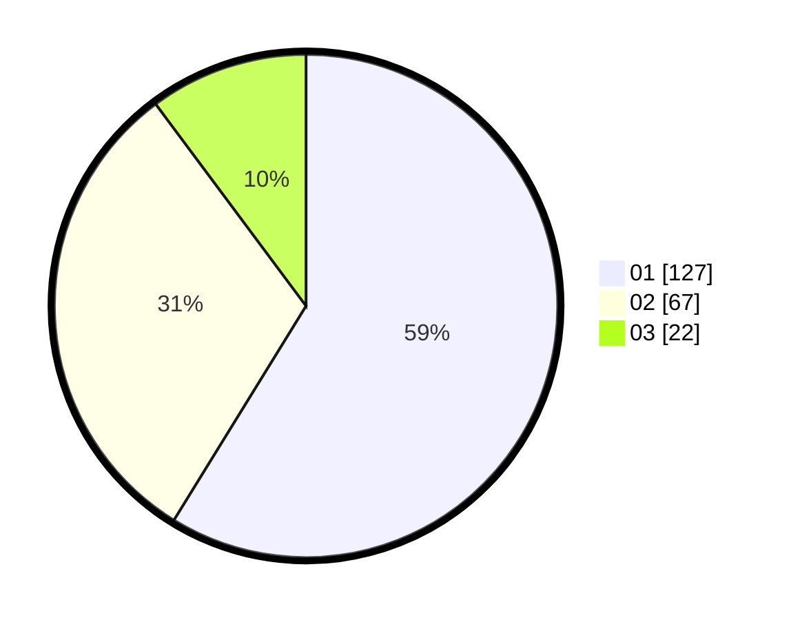

# Hasil

Hasil perolehan suara paslon dapat dilihat pada file paslon-01.txt, paslon-02.txt, dan paslon-03.txt.

Jika tidak ada, artinya data tersebut belum ada pada SIREKAP.

## Perolehan Suara

 * Paslon 01: **127**.
 * Paslon 02: **67**.
 * Paslon 03: **22**.

## Foto C Plano

https://sirekap-obj-formc.kpu.go.id/1aac/pemilu/ppwp/31/71/06/10/01/3171061001014-20240217-084753--823607d0-0ffe-42ca-9f1d-743ee317a89a.jpg

https://sirekap-obj-formc.kpu.go.id/1aac/pemilu/ppwp/31/71/06/10/01/3171061001014-20240217-084804--acb68175-7c75-4a08-93c8-63ff643e2672.jpg
