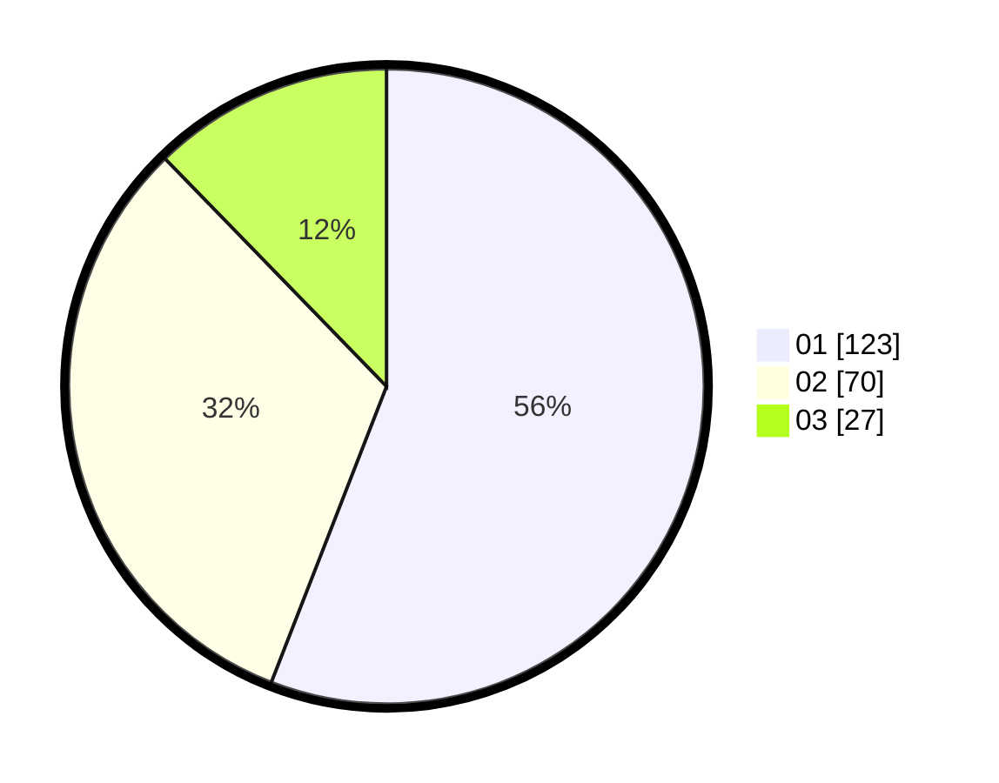

# Hasil

Hasil perolehan suara paslon dapat dilihat pada file paslon-01.txt, paslon-02.txt, dan paslon-03.txt.

Jika tidak ada, artinya data tersebut belum ada pada SIREKAP.

## Perolehan Suara

 * Paslon 01: **123**.
 * Paslon 02: **70**.
 * Paslon 03: **27**.

## Foto C Plano

https://sirekap-obj-formc.kpu.go.id/471d/pemilu/ppwp/31/71/06/10/01/3171061001023-20240218-155605--4a199842-0abe-4ee7-a9a9-99b170447f39.jpg

https://sirekap-obj-formc.kpu.go.id/471d/pemilu/ppwp/31/71/06/10/01/3171061001023-20240218-160509--7640e04f-e1e7-4b43-a731-4ac52d1f398c.jpg

https://sirekap-obj-formc.kpu.go.id/471d/pemilu/ppwp/31/71/06/10/01/3171061001023-20240218-160221--a1dce384-ab51-432c-a560-6ee0de05d8c4.jpg

## DATA PEMILIH TETAP

Jumlah pemilih dalam DPT: **290**.
 * L: **145**.
 * P: **145**.

## DATA PENGGUNA HAK PILIH

Jumlah pengguna hak pilih dalam DPT: **220**.
 * L: **105**.
 * P: **115**.

Jumlah pengguna hak pilih dalam DPTb: **0**.
 * L: **0**.
 * P: **0**.

Jumlah pengguna hak pilih dalam DPK: **2**.
 * L: **1**.
 * P: **1**.

Jumlah pengguna hak pilih: **222**.
 * L: **106**.
 * P: **116**.

## JUMLAH SUARA SAH DAN TIDAK SAH

JUMLAH SELURUH SUARA SAH: **220**.

JUMLAH SUARA TIDAK SAH: **2**.

JUMLAH SELURUH SUARA SAH DAN SUARA TIDAK SAH: **222**.
