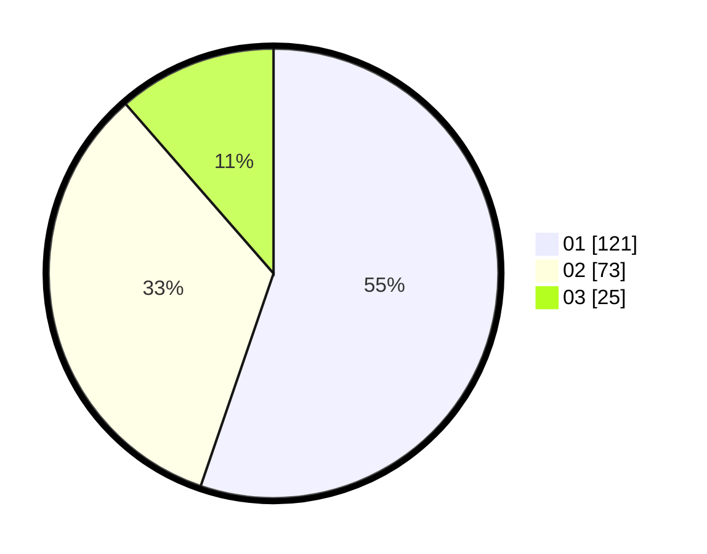

# Hasil

Hasil perolehan suara paslon dapat dilihat pada file paslon-01.txt, paslon-02.txt, dan paslon-03.txt.

Jika tidak ada, artinya data tersebut belum ada pada SIREKAP.

## Perolehan Suara

 * Paslon 01: **121**.
 * Paslon 02: **73**.
 * Paslon 03: **25**.

## Foto C Plano

https://sirekap-obj-formc.kpu.go.id/cf1a/pemilu/ppwp/31/71/06/10/01/3171061001033-20240216-150304--bfbfaafd-95c0-41c6-9e0e-0a71278d5d76.jpg

https://sirekap-obj-formc.kpu.go.id/cf1a/pemilu/ppwp/31/71/06/10/01/3171061001033-20240216-150305--c719be65-c976-49db-b6e2-f57339363ddc.jpg

https://sirekap-obj-formc.kpu.go.id/cf1a/pemilu/ppwp/31/71/06/10/01/3171061001033-20240216-150304--2cd405e8-d533-46b6-9425-8df57185fbd0.jpg

## DATA PEMILIH TETAP

Jumlah pemilih dalam DPT: **281**.
 * L: **131**.
 * P: **150**.

## DATA PENGGUNA HAK PILIH

Jumlah pengguna hak pilih dalam DPT: **223**.
 * L: **106**.
 * P: **117**.

Jumlah pengguna hak pilih dalam DPTb: **1**.
 * L: **0**.
 * P: **1**.

Jumlah pengguna hak pilih dalam DPK: **0**.
 * L: **0**.
 * P: **0**.

Jumlah pengguna hak pilih: **224**.
 * L: **106**.
 * P: **118**.

## JUMLAH SUARA SAH DAN TIDAK SAH

JUMLAH SELURUH SUARA SAH: **219**.

JUMLAH SUARA TIDAK SAH: **5**.

JUMLAH SELURUH SUARA SAH DAN SUARA TIDAK SAH: **224**.
