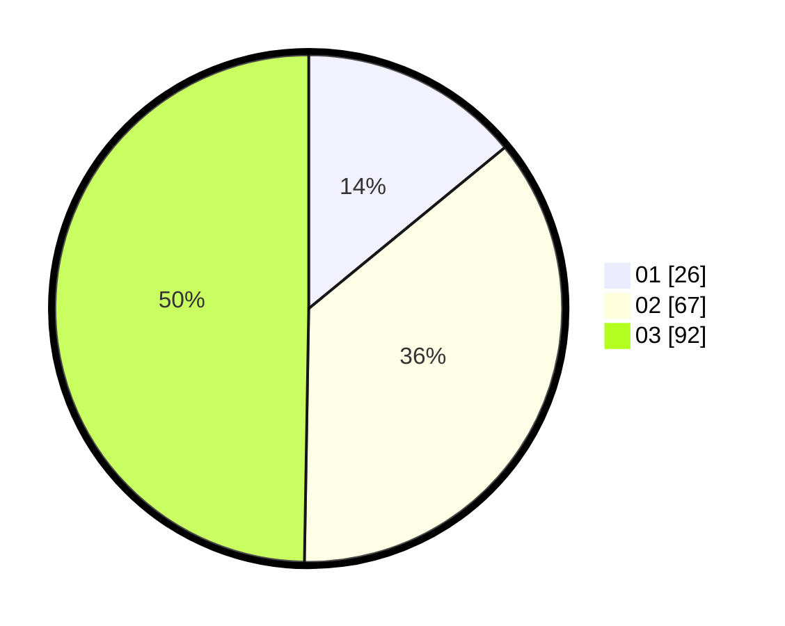

# Hasil

Hasil perolehan suara paslon dapat dilihat pada file paslon-01.txt, paslon-02.txt, dan paslon-03.txt.

Jika tidak ada, artinya data tersebut belum ada pada SIREKAP.

## Perolehan Suara

 * Paslon 01: **26**.
 * Paslon 02: **67**.
 * Paslon 03: **92**.

## Foto C Plano

https://sirekap-obj-formc.kpu.go.id/7b60/pemilu/ppwp/31/71/06/10/01/3171061001037-20240216-152458--5eb2c8f0-7430-4c09-aa4e-8d4de859ac48.jpg

https://sirekap-obj-formc.kpu.go.id/7b60/pemilu/ppwp/31/71/06/10/01/3171061001037-20240216-152500--93f2ba6d-6b9a-4298-afa7-a50db0ee4b58.jpg

https://sirekap-obj-formc.kpu.go.id/7b60/pemilu/ppwp/31/71/06/10/01/3171061001037-20240216-152459--cc9ec430-be47-429e-90d3-95b2af515b0e.jpg

## DATA PEMILIH TETAP

Jumlah pemilih dalam DPT: **0**.
 * L: **0**.
 * P: **0**.

## DATA PENGGUNA HAK PILIH

Jumlah pengguna hak pilih dalam DPT: **0**.
 * L: **0**.
 * P: **0**.

Jumlah pengguna hak pilih dalam DPTb: **0**.
 * L: **0**.
 * P: **0**.

Jumlah pengguna hak pilih dalam DPK: **0**.
 * L: **0**.
 * P: **0**.

Jumlah pengguna hak pilih: **0**.
 * L: **0**.
 * P: **0**.

## JUMLAH SUARA SAH DAN TIDAK SAH

JUMLAH SELURUH SUARA SAH: **185**.

JUMLAH SUARA TIDAK SAH: **3**.

JUMLAH SELURUH SUARA SAH DAN SUARA TIDAK SAH: **188**.
