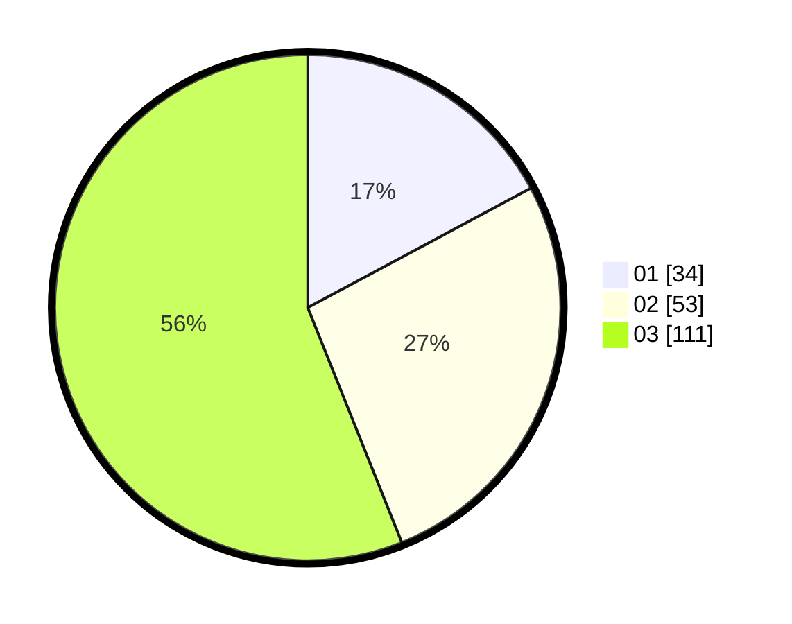

# Hasil

Hasil perolehan suara paslon dapat dilihat pada file paslon-01.txt, paslon-02.txt, dan paslon-03.txt.

Jika tidak ada, artinya data tersebut belum ada pada SIREKAP.

## Perolehan Suara

 * Paslon 01: **34**.
 * Paslon 02: **53**.
 * Paslon 03: **111**.

## Foto C Plano

https://sirekap-obj-formc.kpu.go.id/359a/pemilu/ppwp/31/71/06/10/01/3171061001039-20240215-031941--77e17617-7c73-4c20-9d92-3a89bdb959ab.jpg

https://sirekap-obj-formc.kpu.go.id/359a/pemilu/ppwp/31/71/06/10/01/3171061001039-20240215-032041--a3c88c8f-fdf7-438b-afb6-72b0b4a885db.jpg

https://sirekap-obj-formc.kpu.go.id/359a/pemilu/ppwp/31/71/06/10/01/3171061001039-20240215-032118--59b78e4f-232a-4b24-9897-e11ce58aee7a.jpg

## DATA PEMILIH TETAP

Jumlah pemilih dalam DPT: **273**.
 * L: **131**.
 * P: **142**.

## DATA PENGGUNA HAK PILIH

Jumlah pengguna hak pilih dalam DPT: **171**.
 * L: **79**.
 * P: **92**.

Jumlah pengguna hak pilih dalam DPTb: **23**.
 * L: **10**.
 * P: **13**.

Jumlah pengguna hak pilih dalam DPK: **6**.
 * L: **1**.
 * P: **5**.

Jumlah pengguna hak pilih: **200**.
 * L: **90**.
 * P: **110**.

## JUMLAH SUARA SAH DAN TIDAK SAH

JUMLAH SELURUH SUARA SAH: **198**.

JUMLAH SUARA TIDAK SAH: **2**.

JUMLAH SELURUH SUARA SAH DAN SUARA TIDAK SAH: **200**.
