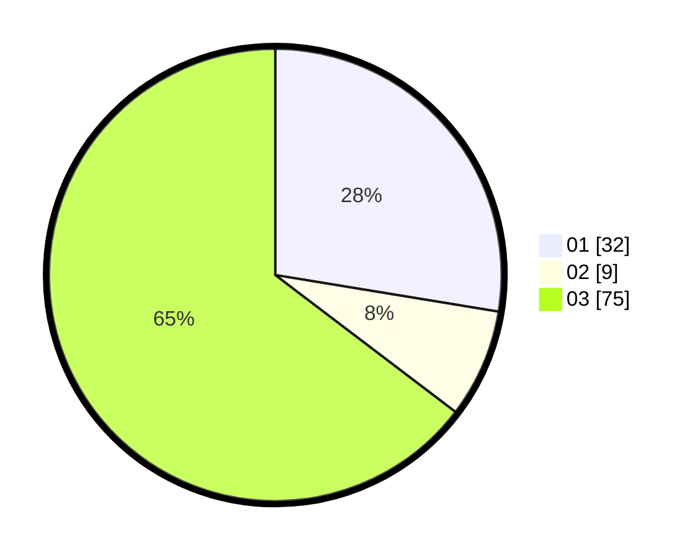

# Hasil

Hasil perolehan suara paslon dapat dilihat pada file paslon-01.txt, paslon-02.txt, dan paslon-03.txt.

Jika tidak ada, artinya data tersebut belum ada pada SIREKAP.

## Perolehan Suara

 * Paslon 01: **32**.
 * Paslon 02: **9**.
 * Paslon 03: **75**.

## Foto C Plano

https://sirekap-obj-formc.kpu.go.id/22bd/pemilu/ppwp/31/71/06/10/01/3171061001044-20240217-170503--c82f8c60-f9bd-4825-9d23-8f0619f2fdc1.jpg

https://sirekap-obj-formc.kpu.go.id/22bd/pemilu/ppwp/31/71/06/10/01/3171061001044-20240217-170822--913a10c4-a129-45b6-88de-d46c8db4dc14.jpg

https://sirekap-obj-formc.kpu.go.id/22bd/pemilu/ppwp/31/71/06/10/01/3171061001044-20240216-214405--e4c26928-27d5-4874-b6b4-5d5c93226df2.jpg

## DATA PEMILIH TETAP

Jumlah pemilih dalam DPT: **214**.
 * L: **98**.
 * P: **116**.

## DATA PENGGUNA HAK PILIH

Jumlah pengguna hak pilih dalam DPT: **159**.
 * L: **72**.
 * P: **87**.

Jumlah pengguna hak pilih dalam DPTb: **20**.
 * L: **5**.
 * P: **15**.

Jumlah pengguna hak pilih dalam DPK: **11**.
 * L: **2**.
 * P: **9**.

Jumlah pengguna hak pilih: **190**.
 * L: **79**.
 * P: **111**.

## JUMLAH SUARA SAH DAN TIDAK SAH

JUMLAH SELURUH SUARA SAH: **186**.

JUMLAH SUARA TIDAK SAH: **4**.

JUMLAH SELURUH SUARA SAH DAN SUARA TIDAK SAH: **190**.
