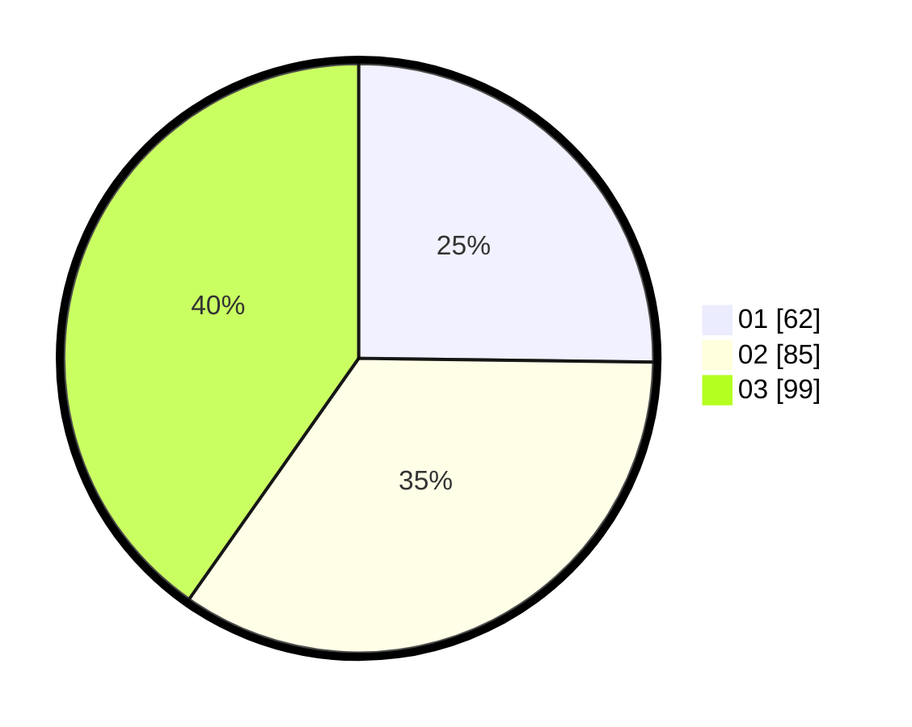

# Hasil

Hasil perolehan suara paslon dapat dilihat pada file paslon-01.txt, paslon-02.txt, dan paslon-03.txt.

Jika tidak ada, artinya data tersebut belum ada pada SIREKAP.

## Perolehan Suara

 * Paslon 01: **62**.
 * Paslon 02: **85**.
 * Paslon 03: **99**.

## Foto C Plano

https://sirekap-obj-formc.kpu.go.id/ac86/pemilu/ppwp/31/71/06/10/01/3171061001048-20240216-143510--2d9a7895-0414-41ed-a63d-8434f001a62e.jpg

https://sirekap-obj-formc.kpu.go.id/ac86/pemilu/ppwp/31/71/06/10/01/3171061001048-20240216-143511--93943a2a-6d33-463c-8b27-e7b821f29d11.jpg

https://sirekap-obj-formc.kpu.go.id/ac86/pemilu/ppwp/31/71/06/10/01/3171061001048-20240216-143510--1d2c0b99-66fc-4720-8d4b-cf478b93710c.jpg

## DATA PEMILIH TETAP

Jumlah pemilih dalam DPT: **285**.
 * L: **139**.
 * P: **146**.

## DATA PENGGUNA HAK PILIH

Jumlah pengguna hak pilih dalam DPT: **218**.
 * L: **107**.
 * P: **111**.

Jumlah pengguna hak pilih dalam DPTb: **26**.
 * L: **8**.
 * P: **18**.

Jumlah pengguna hak pilih dalam DPK: **5**.
 * L: **2**.
 * P: **3**.

Jumlah pengguna hak pilih: **249**.
 * L: **117**.
 * P: **132**.

## JUMLAH SUARA SAH DAN TIDAK SAH

JUMLAH SELURUH SUARA SAH: **246**.

JUMLAH SUARA TIDAK SAH: **3**.

JUMLAH SELURUH SUARA SAH DAN SUARA TIDAK SAH: **249**.
