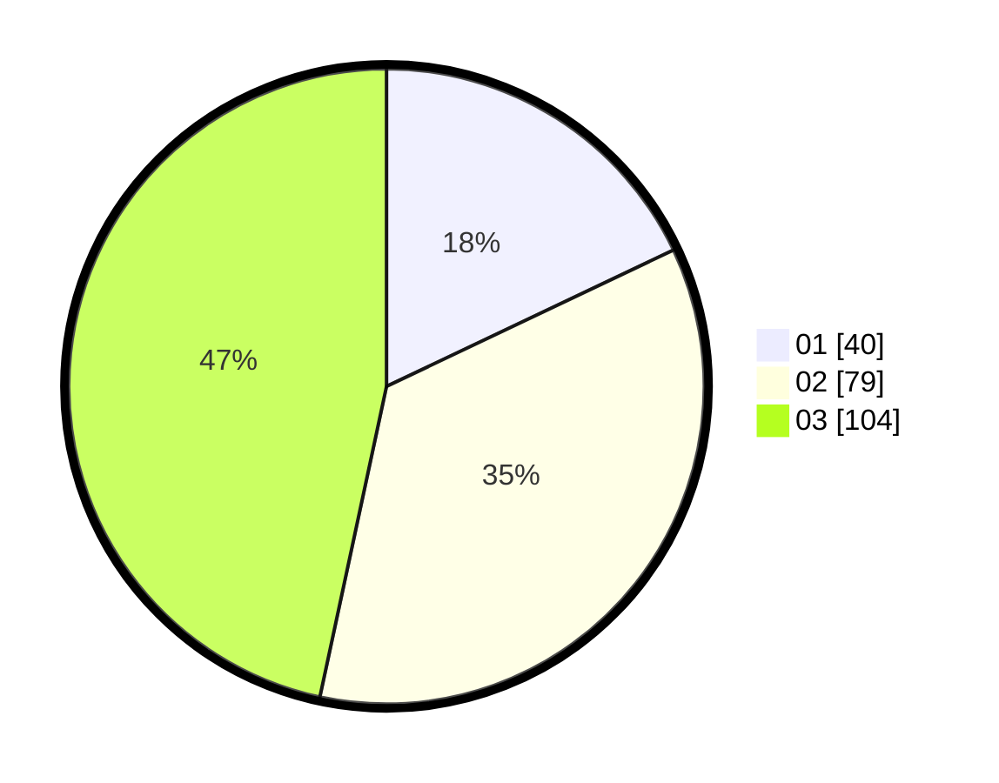

# Hasil

Hasil perolehan suara paslon dapat dilihat pada file paslon-01.txt, paslon-02.txt, dan paslon-03.txt.

Jika tidak ada, artinya data tersebut belum ada pada SIREKAP.

## Perolehan Suara

 * Paslon 01: **40**.
 * Paslon 02: **79**.
 * Paslon 03: **104**.

## Foto C Plano

https://sirekap-obj-formc.kpu.go.id/13e7/pemilu/ppwp/31/71/06/10/01/3171061001049-20240216-165621--60eed724-ab02-4eee-88e7-5e0418172d86.jpg

https://sirekap-obj-formc.kpu.go.id/13e7/pemilu/ppwp/31/71/06/10/01/3171061001049-20240216-165623--fe36c2e7-7d9d-4925-bee7-d8e61f508bf4.jpg

https://sirekap-obj-formc.kpu.go.id/13e7/pemilu/ppwp/31/71/06/10/01/3171061001049-20240216-165622--6bd16135-52ea-46d2-a022-ba7f6d4203bb.jpg

## DATA PEMILIH TETAP

Jumlah pemilih dalam DPT: **287**.
 * L: **137**.
 * P: **150**.

## DATA PENGGUNA HAK PILIH

Jumlah pengguna hak pilih dalam DPT: **207**.
 * L: **100**.
 * P: **107**.

Jumlah pengguna hak pilih dalam DPTb: **24**.
 * L: **11**.
 * P: **13**.

Jumlah pengguna hak pilih dalam DPK: **7**.
 * L: **3**.
 * P: **4**.

Jumlah pengguna hak pilih: **238**.
 * L: **114**.
 * P: **124**.

## JUMLAH SUARA SAH DAN TIDAK SAH

JUMLAH SELURUH SUARA SAH: **223**.

JUMLAH SUARA TIDAK SAH: **15**.

JUMLAH SELURUH SUARA SAH DAN SUARA TIDAK SAH: **238**.
