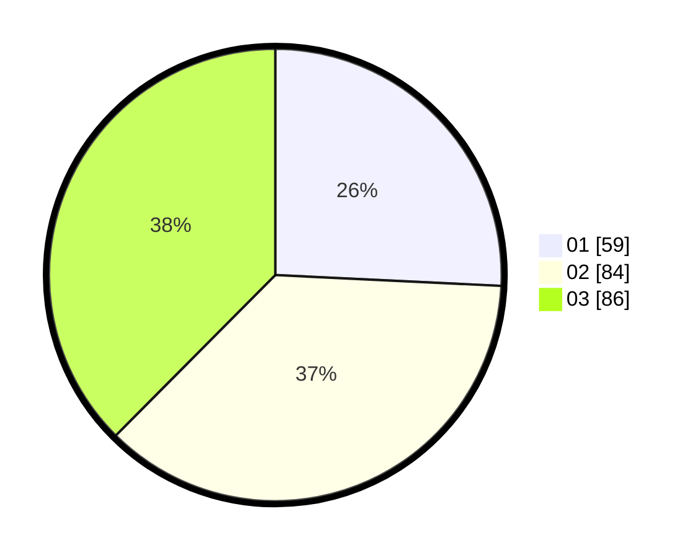

# Hasil

Hasil perolehan suara paslon dapat dilihat pada file paslon-01.txt, paslon-02.txt, dan paslon-03.txt.

Jika tidak ada, artinya data tersebut belum ada pada SIREKAP.

## Perolehan Suara

 * Paslon 01: **59**.
 * Paslon 02: **84**.
 * Paslon 03: **86**.

## Foto C Plano

https://sirekap-obj-formc.kpu.go.id/7466/pemilu/ppwp/31/71/06/10/01/3171061001051-20240214-194638--594d9313-2e7a-4c94-b746-ffaf20a48b16.jpg

https://sirekap-obj-formc.kpu.go.id/7466/pemilu/ppwp/31/71/06/10/01/3171061001051-20240214-202601--b3353fc4-4fbe-4c07-985d-9268413d39a9.jpg

https://sirekap-obj-formc.kpu.go.id/7466/pemilu/ppwp/31/71/06/10/01/3171061001051-20240215-122752--042610f3-f5d0-46ec-8e7a-cb7650e91d5e.jpg

## DATA PEMILIH TETAP

Jumlah pemilih dalam DPT: **264**.
 * L: **114**.
 * P: **150**.

## DATA PENGGUNA HAK PILIH

Jumlah pengguna hak pilih dalam DPT: **199**.
 * L: **88**.
 * P: **111**.

Jumlah pengguna hak pilih dalam DPTb: **19**.
 * L: **3**.
 * P: **16**.

Jumlah pengguna hak pilih dalam DPK: **15**.
 * L: **8**.
 * P: **7**.

Jumlah pengguna hak pilih: **233**.
 * L: **99**.
 * P: **134**.

## JUMLAH SUARA SAH DAN TIDAK SAH

JUMLAH SELURUH SUARA SAH: **229**.

JUMLAH SUARA TIDAK SAH: **4**.

JUMLAH SELURUH SUARA SAH DAN SUARA TIDAK SAH: **233**.
