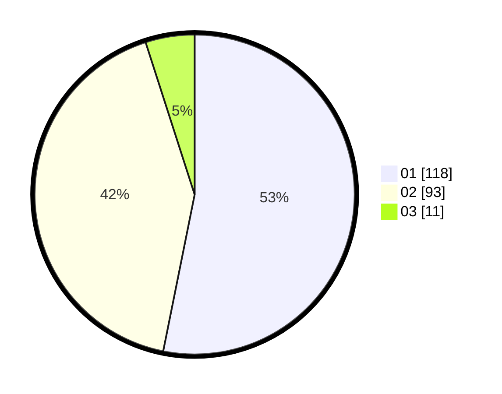

# Hasil

Hasil perolehan suara paslon dapat dilihat pada file paslon-01.txt, paslon-02.txt, dan paslon-03.txt.

Jika tidak ada, artinya data tersebut belum ada pada SIREKAP.

## Perolehan Suara

 * Paslon 01: **118**.
 * Paslon 02: **93**.
 * Paslon 03: **11**.

## Foto C Plano

https://sirekap-obj-formc.kpu.go.id/b83c/pemilu/ppwp/31/71/06/10/01/3171061001054-20240214-211437--2a37ed0b-bf25-462e-bfdd-6929e00030e6.jpg

https://sirekap-obj-formc.kpu.go.id/b83c/pemilu/ppwp/31/71/06/10/01/3171061001054-20240214-211607--d67b5936-a846-4505-8764-f7632f1a74dc.jpg

https://sirekap-obj-formc.kpu.go.id/b83c/pemilu/ppwp/31/71/06/10/01/3171061001054-20240214-200106--9a87771a-db5e-4030-ad24-3ae847401e65.jpg

## DATA PEMILIH TETAP

Jumlah pemilih dalam DPT: **279**.
 * L: **136**.
 * P: **143**.

## DATA PENGGUNA HAK PILIH

Jumlah pengguna hak pilih dalam DPT: **222**.
 * L: **108**.
 * P: **114**.

Jumlah pengguna hak pilih dalam DPTb: **0**.
 * L: **0**.
 * P: **0**.

Jumlah pengguna hak pilih dalam DPK: **5**.
 * L: **3**.
 * P: **2**.

Jumlah pengguna hak pilih: **227**.
 * L: **111**.
 * P: **116**.

## JUMLAH SUARA SAH DAN TIDAK SAH

JUMLAH SELURUH SUARA SAH: **222**.

JUMLAH SUARA TIDAK SAH: **5**.

JUMLAH SELURUH SUARA SAH DAN SUARA TIDAK SAH: **227**.
