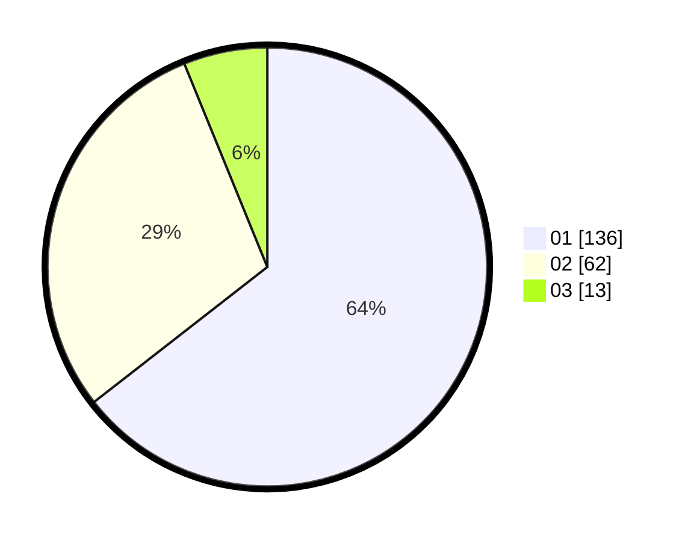

# Hasil

Hasil perolehan suara paslon dapat dilihat pada file paslon-01.txt, paslon-02.txt, dan paslon-03.txt.

Jika tidak ada, artinya data tersebut belum ada pada SIREKAP.

## Perolehan Suara

 * Paslon 01: **136**.
 * Paslon 02: **62**.
 * Paslon 03: **13**.

## Foto C Plano

https://sirekap-obj-formc.kpu.go.id/d9d4/pemilu/ppwp/31/71/06/10/01/3171061001055-20240214-195309--b79c472c-0950-418e-8715-15f195a201a0.jpg

https://sirekap-obj-formc.kpu.go.id/d9d4/pemilu/ppwp/31/71/06/10/01/3171061001055-20240214-195533--dc0501ab-b06a-41ca-b8f6-56d2f8335aa7.jpg

https://sirekap-obj-formc.kpu.go.id/d9d4/pemilu/ppwp/31/71/06/10/01/3171061001055-20240214-192956--50f9f5ab-9e5b-4524-9a1c-e5359ba62df4.jpg
