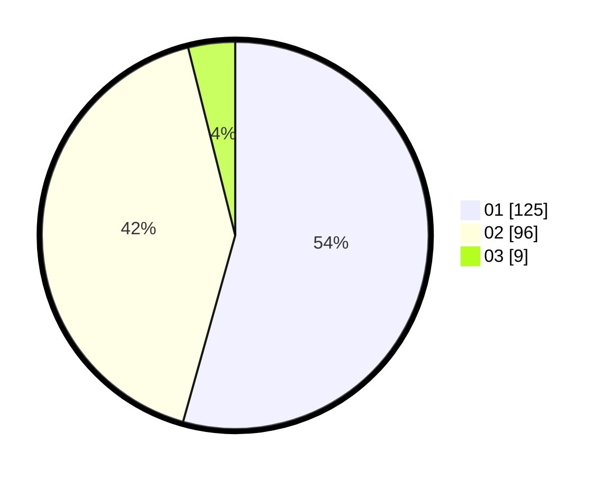

# Hasil

Hasil perolehan suara paslon dapat dilihat pada file paslon-01.txt, paslon-02.txt, dan paslon-03.txt.

Jika tidak ada, artinya data tersebut belum ada pada SIREKAP.

## Perolehan Suara

 * Paslon 01: **125**.
 * Paslon 02: **96**.
 * Paslon 03: **9**.

## Foto C Plano

https://sirekap-obj-formc.kpu.go.id/a9b6/pemilu/ppwp/31/71/06/10/01/3171061001058-20240214-184544--2cd10894-b1c3-4402-a2b6-6132380693a2.jpg

https://sirekap-obj-formc.kpu.go.id/a9b6/pemilu/ppwp/31/71/06/10/01/3171061001058-20240214-184553--8f0a1f64-708a-46f7-9a4d-75892b639248.jpg

https://sirekap-obj-formc.kpu.go.id/a9b6/pemilu/ppwp/31/71/06/10/01/3171061001058-20240214-184610--9f56916f-a8ca-49ef-b70a-b480521a1797.jpg

## DATA PEMILIH TETAP

Jumlah pemilih dalam DPT: **277**.
 * L: **140**.
 * P: **137**.

## DATA PENGGUNA HAK PILIH

Jumlah pengguna hak pilih dalam DPT: **230**.
 * L: **117**.
 * P: **113**.

Jumlah pengguna hak pilih dalam DPTb: **2**.
 * L: **1**.
 * P: **1**.

Jumlah pengguna hak pilih dalam DPK: **1**.
 * L: **0**.
 * P: **1**.

Jumlah pengguna hak pilih: **233**.
 * L: **118**.
 * P: **115**.

## JUMLAH SUARA SAH DAN TIDAK SAH

JUMLAH SELURUH SUARA SAH: **230**.

JUMLAH SUARA TIDAK SAH: **3**.

JUMLAH SELURUH SUARA SAH DAN SUARA TIDAK SAH: **233**.
