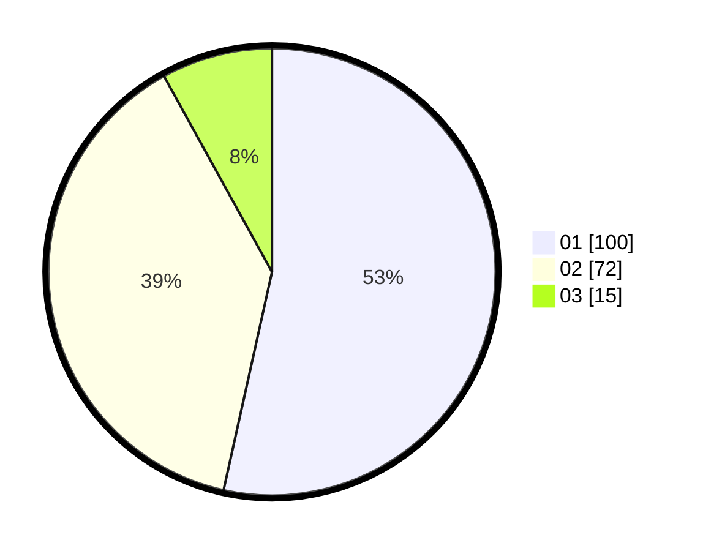

# Hasil

Hasil perolehan suara paslon dapat dilihat pada file paslon-01.txt, paslon-02.txt, dan paslon-03.txt.

Jika tidak ada, artinya data tersebut belum ada pada SIREKAP.

## Perolehan Suara

 * Paslon 01: **100**.
 * Paslon 02: **72**.
 * Paslon 03: **15**.

## Foto C Plano

https://sirekap-obj-formc.kpu.go.id/6860/pemilu/ppwp/31/71/06/10/01/3171061001059-20240214-231124--5a52e70e-c245-4f7c-aa42-365a956cc566.jpg

https://sirekap-obj-formc.kpu.go.id/6860/pemilu/ppwp/31/71/06/10/01/3171061001059-20240214-231230--10f91879-de30-483c-b370-8419742f7821.jpg

https://sirekap-obj-formc.kpu.go.id/6860/pemilu/ppwp/31/71/06/10/01/3171061001059-20240214-231329--3560d0e9-80a2-4393-8351-27110a9b3a6f.jpg

## DATA PEMILIH TETAP

Jumlah pemilih dalam DPT: **275**.
 * L: **137**.
 * P: **138**.

## DATA PENGGUNA HAK PILIH

Jumlah pengguna hak pilih dalam DPT: **191**.
 * L: **90**.
 * P: **101**.

Jumlah pengguna hak pilih dalam DPTb: **0**.
 * L: **0**.
 * P: **0**.

Jumlah pengguna hak pilih dalam DPK: **0**.
 * L: **0**.
 * P: **0**.

Jumlah pengguna hak pilih: **191**.
 * L: **90**.
 * P: **101**.

## JUMLAH SUARA SAH DAN TIDAK SAH

JUMLAH SELURUH SUARA SAH: **187**.

JUMLAH SUARA TIDAK SAH: **4**.

JUMLAH SELURUH SUARA SAH DAN SUARA TIDAK SAH: **191**.
