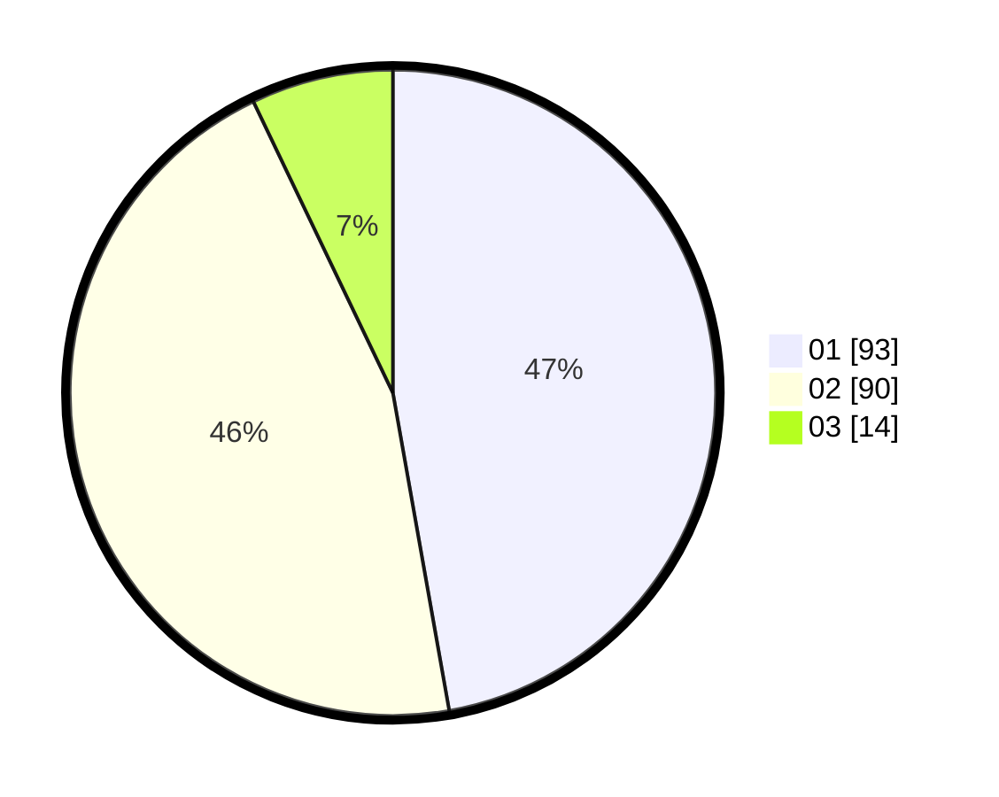

# Hasil

Hasil perolehan suara paslon dapat dilihat pada file paslon-01.txt, paslon-02.txt, dan paslon-03.txt.

Jika tidak ada, artinya data tersebut belum ada pada SIREKAP.

## Perolehan Suara

 * Paslon 01: **93**.
 * Paslon 02: **90**.
 * Paslon 03: **14**.

## Foto C Plano

https://sirekap-obj-formc.kpu.go.id/d425/pemilu/ppwp/31/71/06/10/01/3171061001066-20240215-001050--5ca0fd31-aabd-4a59-8ca7-592e3a2a8d67.jpg

https://sirekap-obj-formc.kpu.go.id/d425/pemilu/ppwp/31/71/06/10/01/3171061001066-20240218-173950--016e92af-c5f1-4ea4-a6e0-85b6e6ac092e.jpg

https://sirekap-obj-formc.kpu.go.id/d425/pemilu/ppwp/31/71/06/10/01/3171061001066-20240214-184833--54ee70d8-ec69-422b-b6f1-baf78e2dcc01.jpg
