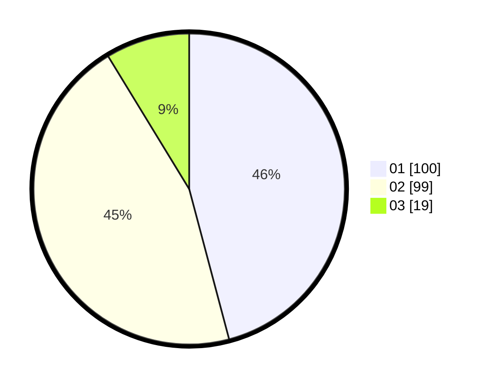

# Hasil

Hasil perolehan suara paslon dapat dilihat pada file paslon-01.txt, paslon-02.txt, dan paslon-03.txt.

Jika tidak ada, artinya data tersebut belum ada pada SIREKAP.

## Perolehan Suara

 * Paslon 01: **100**.
 * Paslon 02: **99**.
 * Paslon 03: **19**.

## Foto C Plano

https://sirekap-obj-formc.kpu.go.id/a38c/pemilu/ppwp/31/71/06/10/01/3171061001067-20240214-221546--c3c1ce21-0db6-4ed4-a7c0-8799b3aee6bc.jpg

https://sirekap-obj-formc.kpu.go.id/a38c/pemilu/ppwp/31/71/06/10/01/3171061001067-20240214-221701--400e4b1b-f162-4873-8a1f-db563cd78089.jpg

https://sirekap-obj-formc.kpu.go.id/a38c/pemilu/ppwp/31/71/06/10/01/3171061001067-20240214-221836--ea8025fa-5906-47df-a526-40e411e66e4d.jpg
