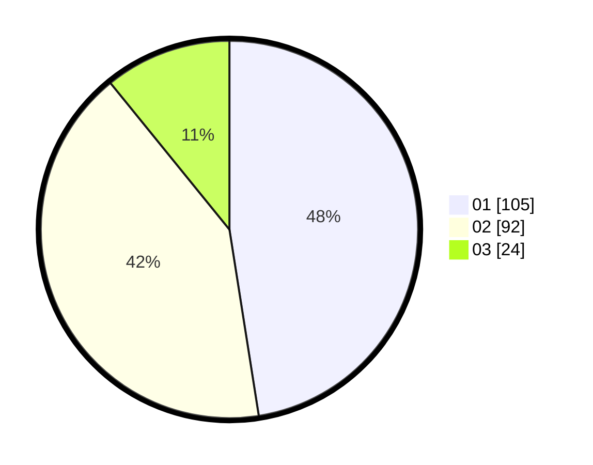

# Hasil

Hasil perolehan suara paslon dapat dilihat pada file paslon-01.txt, paslon-02.txt, dan paslon-03.txt.

Jika tidak ada, artinya data tersebut belum ada pada SIREKAP.

## Perolehan Suara

 * Paslon 01: **105**.
 * Paslon 02: **92**.
 * Paslon 03: **24**.

## Foto C Plano

https://sirekap-obj-formc.kpu.go.id/89c5/pemilu/ppwp/31/71/06/10/01/3171061001068-20240214-231043--b3d45450-4d1d-46d9-9bfb-e89d7ce7bf86.jpg

https://sirekap-obj-formc.kpu.go.id/89c5/pemilu/ppwp/31/71/06/10/01/3171061001068-20240214-231132--c2cb269d-2398-448b-aeb0-273737a30fa4.jpg

https://sirekap-obj-formc.kpu.go.id/89c5/pemilu/ppwp/31/71/06/10/01/3171061001068-20240214-231002--b8c3835d-32fa-4a57-9af3-e492954b7037.jpg

## DATA PEMILIH TETAP

Jumlah pemilih dalam DPT: **273**.
 * L: **127**.
 * P: **146**.

## DATA PENGGUNA HAK PILIH

Jumlah pengguna hak pilih dalam DPT: **222**.
 * L: **102**.
 * P: **120**.

Jumlah pengguna hak pilih dalam DPTb: **1**.
 * L: **1**.
 * P: **0**.

Jumlah pengguna hak pilih dalam DPK: **1**.
 * L: **1**.
 * P: **0**.

Jumlah pengguna hak pilih: **224**.
 * L: **104**.
 * P: **120**.

## JUMLAH SUARA SAH DAN TIDAK SAH

JUMLAH SELURUH SUARA SAH: **221**.

JUMLAH SUARA TIDAK SAH: **3**.

JUMLAH SELURUH SUARA SAH DAN SUARA TIDAK SAH: **224**.
