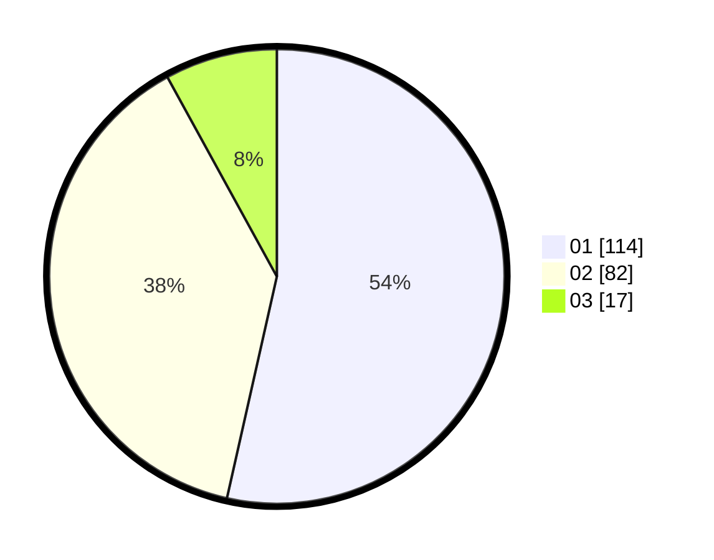

# Hasil

Hasil perolehan suara paslon dapat dilihat pada file paslon-01.txt, paslon-02.txt, dan paslon-03.txt.

Jika tidak ada, artinya data tersebut belum ada pada SIREKAP.

## Perolehan Suara

 * Paslon 01: **114**.
 * Paslon 02: **82**.
 * Paslon 03: **17**.

## Foto C Plano

https://sirekap-obj-formc.kpu.go.id/3790/pemilu/ppwp/31/71/06/10/01/3171061001072-20240215-213406--507ecc6d-30c9-4451-9947-7d9d2bfca859.jpg

https://sirekap-obj-formc.kpu.go.id/3790/pemilu/ppwp/31/71/06/10/01/3171061001072-20240215-213412--63aca880-f9f6-496a-a602-a3b609f6f52b.jpg

https://sirekap-obj-formc.kpu.go.id/3790/pemilu/ppwp/31/71/06/10/01/3171061001072-20240215-213408--d4047b8b-72b2-44ed-acd9-e3b9e76bfe2b.jpg

## DATA PEMILIH TETAP

Jumlah pemilih dalam DPT: **256**.
 * L: **136**.
 * P: **120**.

## DATA PENGGUNA HAK PILIH

Jumlah pengguna hak pilih dalam DPT: **213**.
 * L: **113**.
 * P: **100**.

Jumlah pengguna hak pilih dalam DPTb: **0**.
 * L: **0**.
 * P: **0**.

Jumlah pengguna hak pilih dalam DPK: **0**.
 * L: **0**.
 * P: **0**.

Jumlah pengguna hak pilih: **213**.
 * L: **113**.
 * P: **100**.

## JUMLAH SUARA SAH DAN TIDAK SAH

JUMLAH SELURUH SUARA SAH: **213**.

JUMLAH SUARA TIDAK SAH: **0**.

JUMLAH SELURUH SUARA SAH DAN SUARA TIDAK SAH: **213**.
