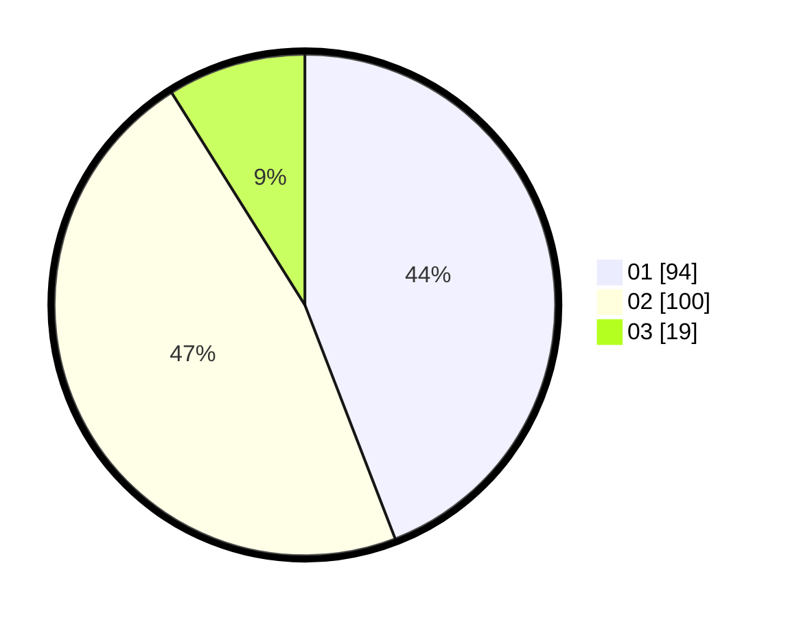

# Hasil

Hasil perolehan suara paslon dapat dilihat pada file paslon-01.txt, paslon-02.txt, dan paslon-03.txt.

Jika tidak ada, artinya data tersebut belum ada pada SIREKAP.

## Perolehan Suara

 * Paslon 01: **94**.
 * Paslon 02: **100**.
 * Paslon 03: **19**.

## Foto C Plano

https://sirekap-obj-formc.kpu.go.id/1f8a/pemilu/ppwp/31/71/06/10/01/3171061001073-20240216-171310--f0fa62d5-6fc1-43f2-8957-87b0902c7f5f.jpg

https://sirekap-obj-formc.kpu.go.id/1f8a/pemilu/ppwp/31/71/06/10/01/3171061001073-20240216-171311--80bc4b42-54ed-4244-a895-be419896adbf.jpg

https://sirekap-obj-formc.kpu.go.id/1f8a/pemilu/ppwp/31/71/06/10/01/3171061001073-20240216-171310--bfa8af4d-5c1b-4e68-b625-a46da3ec9f64.jpg

## DATA PEMILIH TETAP

Jumlah pemilih dalam DPT: **274**.
 * L: **144**.
 * P: **130**.

## DATA PENGGUNA HAK PILIH

Jumlah pengguna hak pilih dalam DPT: **214**.
 * L: **108**.
 * P: **106**.

Jumlah pengguna hak pilih dalam DPTb: **1**.
 * L: **0**.
 * P: **1**.

Jumlah pengguna hak pilih dalam DPK: **0**.
 * L: **0**.
 * P: **0**.

Jumlah pengguna hak pilih: **215**.
 * L: **108**.
 * P: **107**.

## JUMLAH SUARA SAH DAN TIDAK SAH

JUMLAH SELURUH SUARA SAH: **213**.

JUMLAH SUARA TIDAK SAH: **2**.

JUMLAH SELURUH SUARA SAH DAN SUARA TIDAK SAH: **215**.
