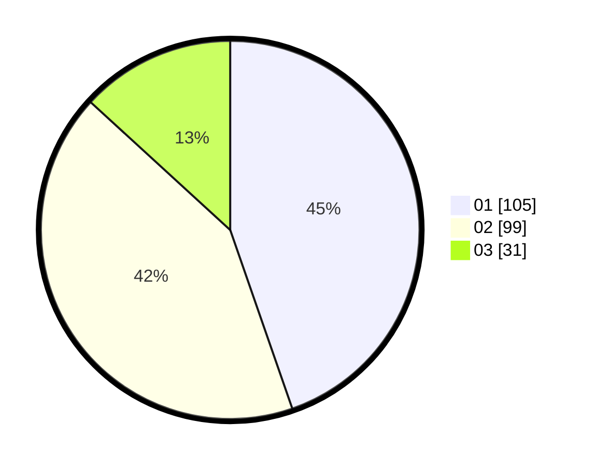

# Hasil

Hasil perolehan suara paslon dapat dilihat pada file paslon-01.txt, paslon-02.txt, dan paslon-03.txt.

Jika tidak ada, artinya data tersebut belum ada pada SIREKAP.

## Perolehan Suara

 * Paslon 01: **105**.
 * Paslon 02: **99**.
 * Paslon 03: **31**.

## Foto C Plano

https://sirekap-obj-formc.kpu.go.id/d3ec/pemilu/ppwp/31/71/06/10/01/3171061001076-20240215-024632--974ef5e4-cbec-40ae-a711-7c2d36d9a435.jpg

https://sirekap-obj-formc.kpu.go.id/d3ec/pemilu/ppwp/31/71/06/10/01/3171061001076-20240214-221538--1ca13bb0-93cc-4d71-8a4a-20ecfde6dd7f.jpg

https://sirekap-obj-formc.kpu.go.id/d3ec/pemilu/ppwp/31/71/06/10/01/3171061001076-20240214-223352--b2956c7c-99e7-4a3e-9198-9f11a6630810.jpg

## DATA PEMILIH TETAP

Jumlah pemilih dalam DPT: **271**.
 * L: **127**.
 * P: **144**.

## DATA PENGGUNA HAK PILIH

Jumlah pengguna hak pilih dalam DPT: **235**.
 * L: **109**.
 * P: **126**.

Jumlah pengguna hak pilih dalam DPTb: **1**.
 * L: **1**.
 * P: **0**.

Jumlah pengguna hak pilih dalam DPK: **0**.
 * L: **0**.
 * P: **0**.

Jumlah pengguna hak pilih: **236**.
 * L: **110**.
 * P: **126**.

## JUMLAH SUARA SAH DAN TIDAK SAH

JUMLAH SELURUH SUARA SAH: **236**.

JUMLAH SUARA TIDAK SAH: **0**.

JUMLAH SELURUH SUARA SAH DAN SUARA TIDAK SAH: **236**.
