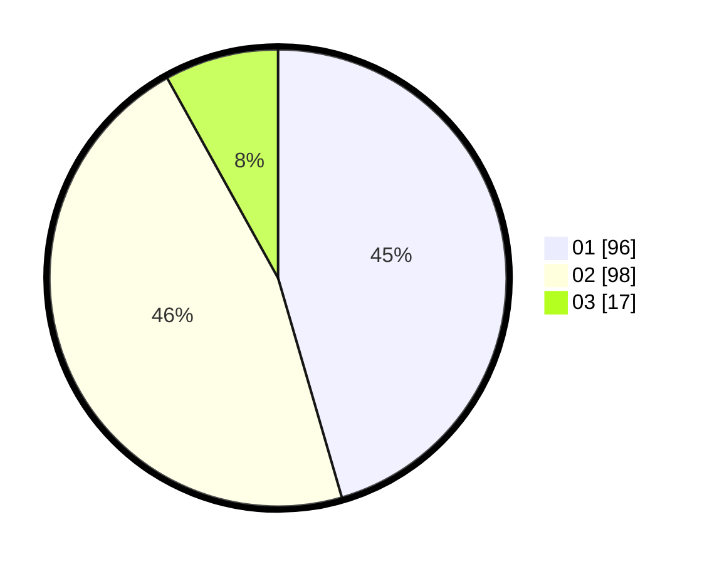

# Hasil

Hasil perolehan suara paslon dapat dilihat pada file paslon-01.txt, paslon-02.txt, dan paslon-03.txt.

Jika tidak ada, artinya data tersebut belum ada pada SIREKAP.

## Perolehan Suara

 * Paslon 01: **96**.
 * Paslon 02: **98**.
 * Paslon 03: **17**.

## Foto C Plano

https://sirekap-obj-formc.kpu.go.id/00a6/pemilu/ppwp/31/71/06/10/01/3171061001080-20240216-012244--af7b394f-d017-413a-b5b7-31bcbfd562e1.jpg

https://sirekap-obj-formc.kpu.go.id/00a6/pemilu/ppwp/31/71/06/10/01/3171061001080-20240216-012246--2e1d7352-21ab-4e00-9197-fd135918ee73.jpg

https://sirekap-obj-formc.kpu.go.id/00a6/pemilu/ppwp/31/71/06/10/01/3171061001080-20240216-012245--787b260a-6a7e-4165-8899-6d99eaaf363c.jpg

## DATA PEMILIH TETAP

Jumlah pemilih dalam DPT: **276**.
 * L: **144**.
 * P: **132**.

## DATA PENGGUNA HAK PILIH

Jumlah pengguna hak pilih dalam DPT: **201**.
 * L: **96**.
 * P: **105**.

Jumlah pengguna hak pilih dalam DPTb: **6**.
 * L: **4**.
 * P: **2**.

Jumlah pengguna hak pilih dalam DPK: **5**.
 * L: **1**.
 * P: **4**.

Jumlah pengguna hak pilih: **212**.
 * L: **201**.
 * P: **11**.

## JUMLAH SUARA SAH DAN TIDAK SAH

JUMLAH SELURUH SUARA SAH: **211**.

JUMLAH SUARA TIDAK SAH: **1**.

JUMLAH SELURUH SUARA SAH DAN SUARA TIDAK SAH: **212**.
