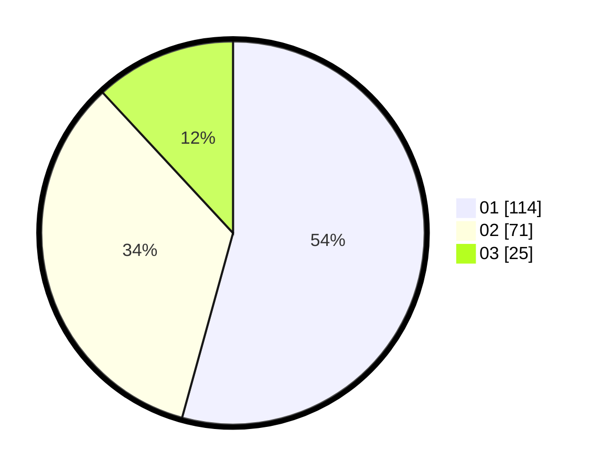

# Hasil

Hasil perolehan suara paslon dapat dilihat pada file paslon-01.txt, paslon-02.txt, dan paslon-03.txt.

Jika tidak ada, artinya data tersebut belum ada pada SIREKAP.

## Perolehan Suara

 * Paslon 01: **114**.
 * Paslon 02: **71**.
 * Paslon 03: **25**.

## Foto C Plano

https://sirekap-obj-formc.kpu.go.id/d4f1/pemilu/ppwp/31/71/06/10/02/3171061002002-20240214-201328--8ee337e8-ea3b-405a-a9c6-0cbb7946896e.jpg

https://sirekap-obj-formc.kpu.go.id/d4f1/pemilu/ppwp/31/71/06/10/02/3171061002002-20240214-201451--7fec1ed7-c698-4887-b70e-3c97114001c3.jpg

https://sirekap-obj-formc.kpu.go.id/d4f1/pemilu/ppwp/31/71/06/10/02/3171061002002-20240214-201612--84348659-0ffb-4c6a-9949-5bd7d96c1cbe.jpg

## DATA PEMILIH TETAP

Jumlah pemilih dalam DPT: **275**.
 * L: **141**.
 * P: **134**.

## DATA PENGGUNA HAK PILIH

Jumlah pengguna hak pilih dalam DPT: **214**.
 * L: **102**.
 * P: **112**.

Jumlah pengguna hak pilih dalam DPTb: **1**.
 * L: **0**.
 * P: **1**.

Jumlah pengguna hak pilih dalam DPK: **0**.
 * L: **0**.
 * P: **0**.

Jumlah pengguna hak pilih: **215**.
 * L: **102**.
 * P: **113**.

## JUMLAH SUARA SAH DAN TIDAK SAH

JUMLAH SELURUH SUARA SAH: **210**.

JUMLAH SUARA TIDAK SAH: **5**.

JUMLAH SELURUH SUARA SAH DAN SUARA TIDAK SAH: **215**.
