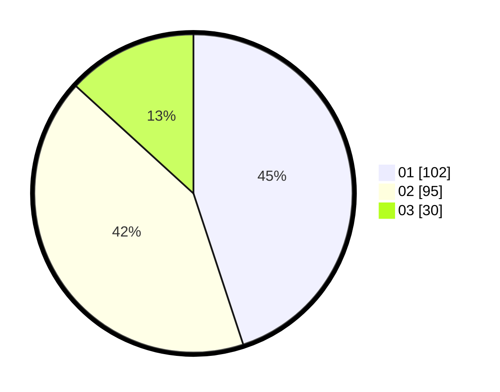

# Hasil

Hasil perolehan suara paslon dapat dilihat pada file paslon-01.txt, paslon-02.txt, dan paslon-03.txt.

Jika tidak ada, artinya data tersebut belum ada pada SIREKAP.

## Perolehan Suara

 * Paslon 01: **102**.
 * Paslon 02: **95**.
 * Paslon 03: **30**.

## Foto C Plano

https://sirekap-obj-formc.kpu.go.id/02c7/pemilu/ppwp/31/71/06/10/02/3171061002005-20240214-222800--b63b0b0f-eba3-40f6-a053-1f0273f58685.jpg

https://sirekap-obj-formc.kpu.go.id/02c7/pemilu/ppwp/31/71/06/10/02/3171061002005-20240214-230514--55c98a41-3dc0-4eb9-a7f6-08f25364e3eb.jpg

https://sirekap-obj-formc.kpu.go.id/02c7/pemilu/ppwp/31/71/06/10/02/3171061002005-20240214-214302--8665970e-4c1b-4a10-8a75-cf1cf6d07843.jpg

## DATA PEMILIH TETAP

Jumlah pemilih dalam DPT: **277**.
 * L: **145**.
 * P: **132**.

## DATA PENGGUNA HAK PILIH

Jumlah pengguna hak pilih dalam DPT: **220**.
 * L: **109**.
 * P: **111**.

Jumlah pengguna hak pilih dalam DPTb: **1**.
 * L: **1**.
 * P: **0**.

Jumlah pengguna hak pilih dalam DPK: **8**.
 * L: **5**.
 * P: **3**.

Jumlah pengguna hak pilih: **229**.
 * L: **115**.
 * P: **114**.

## JUMLAH SUARA SAH DAN TIDAK SAH

JUMLAH SELURUH SUARA SAH: **227**.

JUMLAH SUARA TIDAK SAH: **2**.

JUMLAH SELURUH SUARA SAH DAN SUARA TIDAK SAH: **229**.
