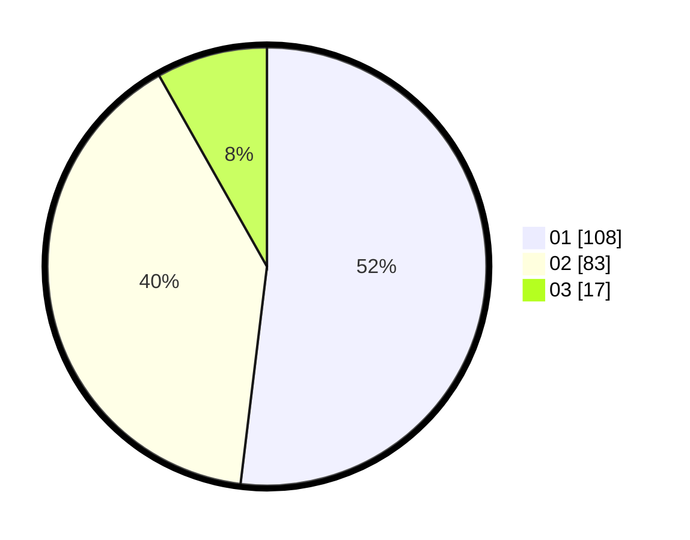

# Hasil

Hasil perolehan suara paslon dapat dilihat pada file paslon-01.txt, paslon-02.txt, dan paslon-03.txt.

Jika tidak ada, artinya data tersebut belum ada pada SIREKAP.

## Perolehan Suara

 * Paslon 01: **108**.
 * Paslon 02: **83**.
 * Paslon 03: **17**.

## Foto C Plano

https://sirekap-obj-formc.kpu.go.id/e69e/pemilu/ppwp/31/71/06/10/02/3171061002008-20240216-143715--3f107a91-c9ea-49c2-b5ae-b09fb532cd7e.jpg

https://sirekap-obj-formc.kpu.go.id/e69e/pemilu/ppwp/31/71/06/10/02/3171061002008-20240216-143716--04bd500b-ce59-4c58-bf54-116151af7c79.jpg

https://sirekap-obj-formc.kpu.go.id/e69e/pemilu/ppwp/31/71/06/10/02/3171061002008-20240216-143715--c536c214-bdbf-4144-be9b-6c0afc9eeca9.jpg

## DATA PEMILIH TETAP

Jumlah pemilih dalam DPT: **274**.
 * L: **152**.
 * P: **122**.

## DATA PENGGUNA HAK PILIH

Jumlah pengguna hak pilih dalam DPT: **208**.
 * L: **110**.
 * P: **98**.

Jumlah pengguna hak pilih dalam DPTb: **5**.
 * L: **1**.
 * P: **4**.

Jumlah pengguna hak pilih dalam DPK: **0**.
 * L: **0**.
 * P: **0**.

Jumlah pengguna hak pilih: **213**.
 * L: **111**.
 * P: **102**.

## JUMLAH SUARA SAH DAN TIDAK SAH

JUMLAH SELURUH SUARA SAH: **208**.

JUMLAH SUARA TIDAK SAH: **5**.

JUMLAH SELURUH SUARA SAH DAN SUARA TIDAK SAH: **213**.
