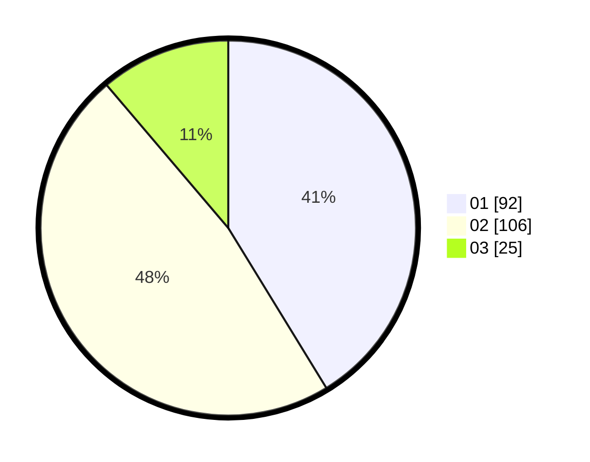

# Hasil

Hasil perolehan suara paslon dapat dilihat pada file paslon-01.txt, paslon-02.txt, dan paslon-03.txt.

Jika tidak ada, artinya data tersebut belum ada pada SIREKAP.

## Perolehan Suara

 * Paslon 01: **92**.
 * Paslon 02: **106**.
 * Paslon 03: **25**.

## Foto C Plano

https://sirekap-obj-formc.kpu.go.id/ed22/pemilu/ppwp/31/71/06/10/02/3171061002009-20240216-133125--01922c68-4723-455f-9b81-52de2f0534e4.jpg

https://sirekap-obj-formc.kpu.go.id/ed22/pemilu/ppwp/31/71/06/10/02/3171061002009-20240216-133127--c2285231-a291-48dd-a3f3-d421fc51fa8a.jpg

https://sirekap-obj-formc.kpu.go.id/ed22/pemilu/ppwp/31/71/06/10/02/3171061002009-20240216-133126--b830faee-0fa7-4544-b5c4-f2a6ceee8877.jpg

## DATA PEMILIH TETAP

Jumlah pemilih dalam DPT: **275**.
 * L: **134**.
 * P: **141**.

## DATA PENGGUNA HAK PILIH

Jumlah pengguna hak pilih dalam DPT: **221**.
 * L: **102**.
 * P: **119**.

Jumlah pengguna hak pilih dalam DPTb: **0**.
 * L: **0**.
 * P: **0**.

Jumlah pengguna hak pilih dalam DPK: **3**.
 * L: **2**.
 * P: **1**.

Jumlah pengguna hak pilih: **224**.
 * L: **104**.
 * P: **120**.

## JUMLAH SUARA SAH DAN TIDAK SAH

JUMLAH SELURUH SUARA SAH: **223**.

JUMLAH SUARA TIDAK SAH: **1**.

JUMLAH SELURUH SUARA SAH DAN SUARA TIDAK SAH: **224**.
