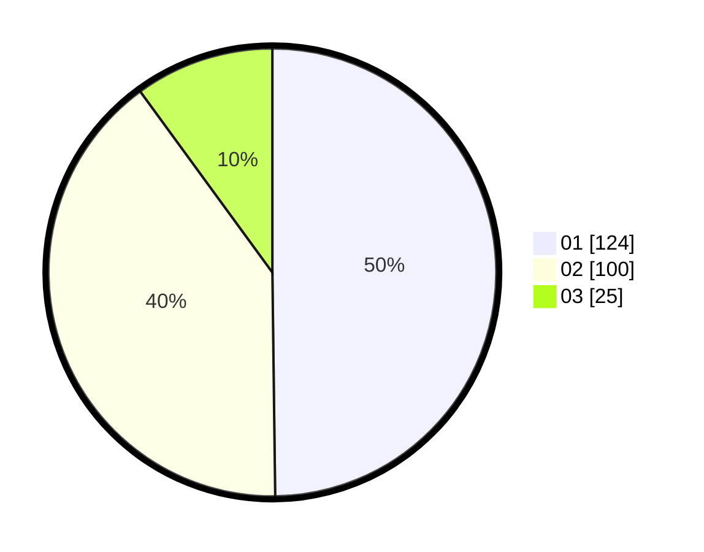

# Hasil

Hasil perolehan suara paslon dapat dilihat pada file paslon-01.txt, paslon-02.txt, dan paslon-03.txt.

Jika tidak ada, artinya data tersebut belum ada pada SIREKAP.

## Perolehan Suara

 * Paslon 01: **124**.
 * Paslon 02: **100**.
 * Paslon 03: **25**.

## Foto C Plano

https://sirekap-obj-formc.kpu.go.id/0bf8/pemilu/ppwp/31/71/06/10/02/3171061002017-20240218-161610--5b9dc991-1ce3-4e1c-af3a-ac69afd17040.jpg

https://sirekap-obj-formc.kpu.go.id/0bf8/pemilu/ppwp/31/71/06/10/02/3171061002017-20240218-162637--845395af-8cd7-40c4-9e9c-c2f040c2734b.jpg

https://sirekap-obj-formc.kpu.go.id/0bf8/pemilu/ppwp/31/71/06/10/02/3171061002017-20240218-162727--ec9c722e-d9ba-47d5-aa49-f0b5e2e26536.jpg

## DATA PEMILIH TETAP

Jumlah pemilih dalam DPT: **290**.
 * L: **142**.
 * P: **148**.

## DATA PENGGUNA HAK PILIH

Jumlah pengguna hak pilih dalam DPT: **235**.
 * L: **115**.
 * P: **120**.

Jumlah pengguna hak pilih dalam DPTb: **16**.
 * L: **7**.
 * P: **9**.

Jumlah pengguna hak pilih dalam DPK: **0**.
 * L: **0**.
 * P: **0**.

Jumlah pengguna hak pilih: **251**.
 * L: **122**.
 * P: **129**.

## JUMLAH SUARA SAH DAN TIDAK SAH

JUMLAH SELURUH SUARA SAH: **249**.

JUMLAH SUARA TIDAK SAH: **2**.

JUMLAH SELURUH SUARA SAH DAN SUARA TIDAK SAH: **251**.
