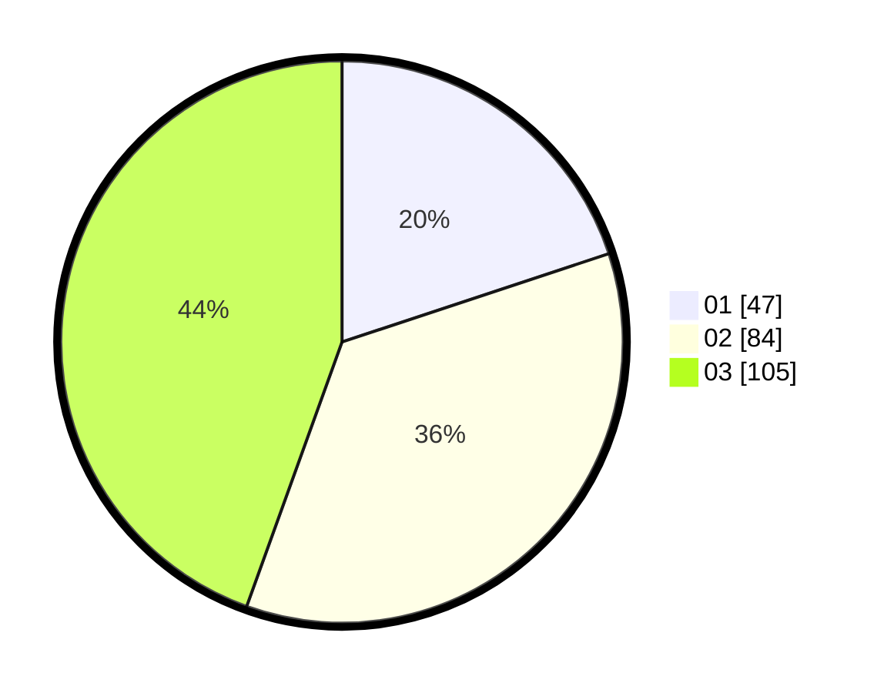

# Hasil

Hasil perolehan suara paslon dapat dilihat pada file paslon-01.txt, paslon-02.txt, dan paslon-03.txt.

Jika tidak ada, artinya data tersebut belum ada pada SIREKAP.

## Perolehan Suara

 * Paslon 01: **47**.
 * Paslon 02: **84**.
 * Paslon 03: **105**.

## Foto C Plano

https://sirekap-obj-formc.kpu.go.id/4988/pemilu/ppwp/31/71/06/10/02/3171061002018-20240214-194103--acef991a-8f0c-4c10-8c41-84feffeae185.jpg

https://sirekap-obj-formc.kpu.go.id/4988/pemilu/ppwp/31/71/06/10/02/3171061002018-20240214-194225--ff9f80a0-6a0f-438f-83e4-8d77f058e12d.jpg

https://sirekap-obj-formc.kpu.go.id/4988/pemilu/ppwp/31/71/06/10/02/3171061002018-20240214-194323--b439c41a-f55c-4071-a20b-8cc5f7dc4682.jpg

## DATA PEMILIH TETAP

Jumlah pemilih dalam DPT: **279**.
 * L: **130**.
 * P: **149**.

## DATA PENGGUNA HAK PILIH

Jumlah pengguna hak pilih dalam DPT: **217**.
 * L: **99**.
 * P: **118**.

Jumlah pengguna hak pilih dalam DPTb: **19**.
 * L: **5**.
 * P: **14**.

Jumlah pengguna hak pilih dalam DPK: **3**.
 * L: **2**.
 * P: **1**.

Jumlah pengguna hak pilih: **239**.
 * L: **106**.
 * P: **133**.

## JUMLAH SUARA SAH DAN TIDAK SAH

JUMLAH SELURUH SUARA SAH: **236**.

JUMLAH SUARA TIDAK SAH: **3**.

JUMLAH SELURUH SUARA SAH DAN SUARA TIDAK SAH: **239**.
