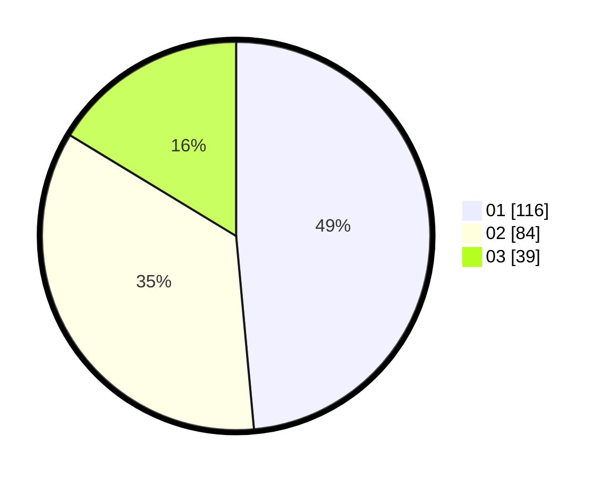

# Hasil

Hasil perolehan suara paslon dapat dilihat pada file paslon-01.txt, paslon-02.txt, dan paslon-03.txt.

Jika tidak ada, artinya data tersebut belum ada pada SIREKAP.

## Perolehan Suara

 * Paslon 01: **116**.
 * Paslon 02: **84**.
 * Paslon 03: **39**.

## Foto C Plano

https://sirekap-obj-formc.kpu.go.id/cfae/pemilu/ppwp/31/71/06/10/02/3171061002019-20240214-193704--d8c0afa8-ff5c-4c4b-b50a-1ac885201730.jpg

https://sirekap-obj-formc.kpu.go.id/cfae/pemilu/ppwp/31/71/06/10/02/3171061002019-20240214-193831--818d1233-3b78-4bac-9cc3-cdea104a2db0.jpg

https://sirekap-obj-formc.kpu.go.id/cfae/pemilu/ppwp/31/71/06/10/02/3171061002019-20240214-193919--93f54e0a-d533-4cd2-aef5-5082d21ac8c7.jpg

## DATA PEMILIH TETAP

Jumlah pemilih dalam DPT: **292**.
 * L: **137**.
 * P: **155**.

## DATA PENGGUNA HAK PILIH

Jumlah pengguna hak pilih dalam DPT: **228**.
 * L: **105**.
 * P: **123**.

Jumlah pengguna hak pilih dalam DPTb: **15**.
 * L: **3**.
 * P: **12**.

Jumlah pengguna hak pilih dalam DPK: **2**.
 * L: **1**.
 * P: **1**.

Jumlah pengguna hak pilih: **245**.
 * L: **109**.
 * P: **136**.

## JUMLAH SUARA SAH DAN TIDAK SAH

JUMLAH SELURUH SUARA SAH: **239**.

JUMLAH SUARA TIDAK SAH: **6**.

JUMLAH SELURUH SUARA SAH DAN SUARA TIDAK SAH: **245**.
