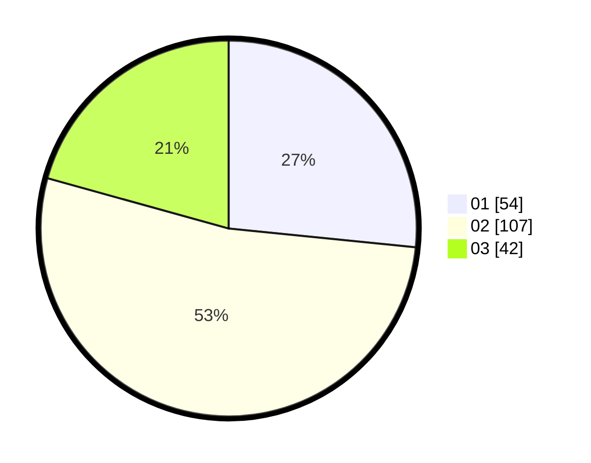

# Hasil

Hasil perolehan suara paslon dapat dilihat pada file paslon-01.txt, paslon-02.txt, dan paslon-03.txt.

Jika tidak ada, artinya data tersebut belum ada pada SIREKAP.

## Perolehan Suara

 * Paslon 01: **54**.
 * Paslon 02: **107**.
 * Paslon 03: **42**.

## Foto C Plano

https://sirekap-obj-formc.kpu.go.id/8ee5/pemilu/ppwp/31/71/06/10/02/3171061002030-20240218-154832--109871f5-c1db-4732-ae77-ddc2c6d9a238.jpg

https://sirekap-obj-formc.kpu.go.id/8ee5/pemilu/ppwp/31/71/06/10/02/3171061002030-20240218-155102--782ca7d2-9df3-4b77-89b5-f14c6bac892d.jpg

https://sirekap-obj-formc.kpu.go.id/8ee5/pemilu/ppwp/31/71/06/10/02/3171061002030-20240218-155251--33d1a4ea-5069-41cc-a7b0-2510c430e4ea.jpg

## DATA PEMILIH TETAP

Jumlah pemilih dalam DPT: **265**.
 * L: **140**.
 * P: **125**.

## DATA PENGGUNA HAK PILIH

Jumlah pengguna hak pilih dalam DPT: **190**.
 * L: **98**.
 * P: **92**.

Jumlah pengguna hak pilih dalam DPTb: **9**.
 * L: **6**.
 * P: **3**.

Jumlah pengguna hak pilih dalam DPK: **5**.
 * L: **2**.
 * P: **3**.

Jumlah pengguna hak pilih: **204**.
 * L: **106**.
 * P: **98**.

## JUMLAH SUARA SAH DAN TIDAK SAH

JUMLAH SELURUH SUARA SAH: **203**.

JUMLAH SUARA TIDAK SAH: **1**.

JUMLAH SELURUH SUARA SAH DAN SUARA TIDAK SAH: **204**.
