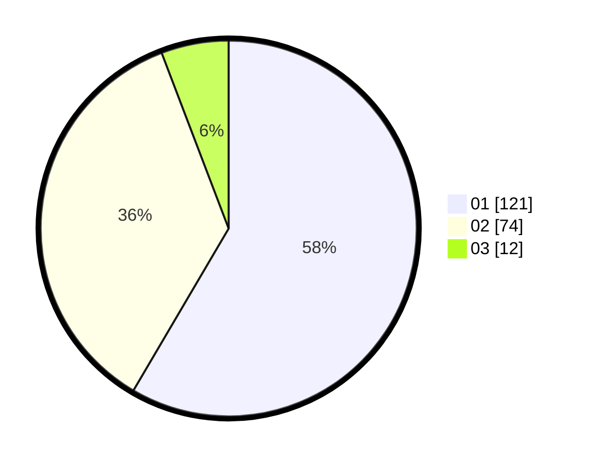

# Hasil

Hasil perolehan suara paslon dapat dilihat pada file paslon-01.txt, paslon-02.txt, dan paslon-03.txt.

Jika tidak ada, artinya data tersebut belum ada pada SIREKAP.

## Perolehan Suara

 * Paslon 01: **121**.
 * Paslon 02: **74**.
 * Paslon 03: **12**.

## Foto C Plano

https://sirekap-obj-formc.kpu.go.id/9ece/pemilu/ppwp/31/71/06/10/02/3171061002039-20240214-202804--69bc5859-c99f-4ae5-a05b-a37eae13fe91.jpg

https://sirekap-obj-formc.kpu.go.id/9ece/pemilu/ppwp/31/71/06/10/02/3171061002039-20240214-202829--f6deaeec-602f-4c7e-90b5-0def8f688c15.jpg

https://sirekap-obj-formc.kpu.go.id/9ece/pemilu/ppwp/31/71/06/10/02/3171061002039-20240214-202901--8cfdf55d-6489-4981-8f56-76eeb2e00990.jpg
