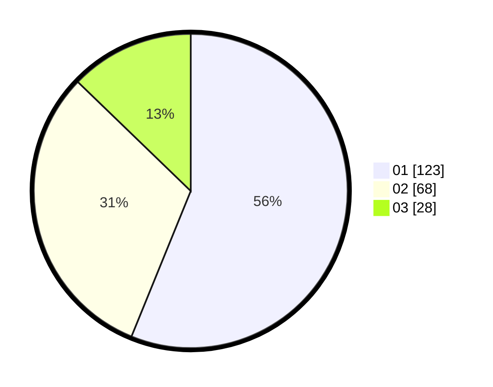

# Hasil

Hasil perolehan suara paslon dapat dilihat pada file paslon-01.txt, paslon-02.txt, dan paslon-03.txt.

Jika tidak ada, artinya data tersebut belum ada pada SIREKAP.

## Perolehan Suara

 * Paslon 01: **123**.
 * Paslon 02: **68**.
 * Paslon 03: **28**.

## Foto C Plano

https://sirekap-obj-formc.kpu.go.id/51ee/pemilu/ppwp/31/71/06/10/02/3171061002040-20240218-172238--2ac18f0e-e9f1-429a-b110-053c174c9843.jpg

https://sirekap-obj-formc.kpu.go.id/51ee/pemilu/ppwp/31/71/06/10/02/3171061002040-20240218-173910--5c19ce50-4f85-4c12-80bf-c0c56563a750.jpg

https://sirekap-obj-formc.kpu.go.id/51ee/pemilu/ppwp/31/71/06/10/02/3171061002040-20240218-174054--2f8a2cf1-b587-4b62-b764-2f87fcf25ebc.jpg

## DATA PEMILIH TETAP

Jumlah pemilih dalam DPT: **222**.
 * L: **134**.
 * P: **135**.

## DATA PENGGUNA HAK PILIH

Jumlah pengguna hak pilih dalam DPT: **222**.
 * L: **106**.
 * P: **116**.

Jumlah pengguna hak pilih dalam DPTb: **0**.
 * L: **0**.
 * P: **0**.

Jumlah pengguna hak pilih dalam DPK: **0**.
 * L: **0**.
 * P: **0**.

Jumlah pengguna hak pilih: **222**.
 * L: **106**.
 * P: **116**.

## JUMLAH SUARA SAH DAN TIDAK SAH

JUMLAH SELURUH SUARA SAH: **219**.

JUMLAH SUARA TIDAK SAH: **3**.

JUMLAH SELURUH SUARA SAH DAN SUARA TIDAK SAH: **222**.
