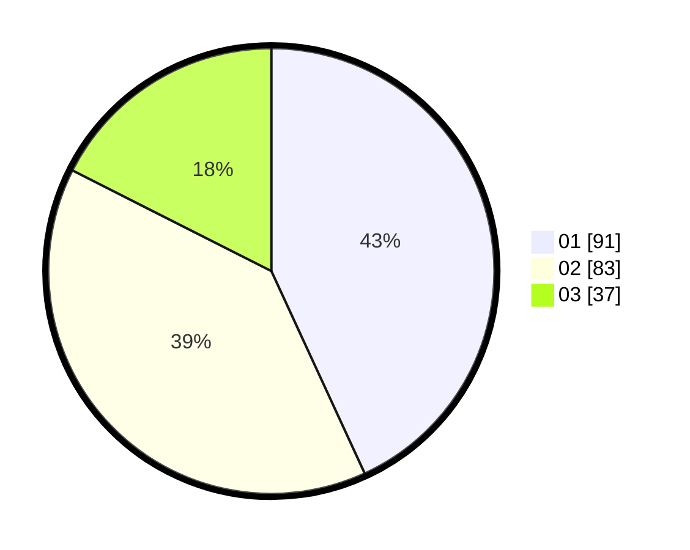

# Hasil

Hasil perolehan suara paslon dapat dilihat pada file paslon-01.txt, paslon-02.txt, dan paslon-03.txt.

Jika tidak ada, artinya data tersebut belum ada pada SIREKAP.

## Perolehan Suara

 * Paslon 01: **91**.
 * Paslon 02: **83**.
 * Paslon 03: **37**.

## Foto C Plano

https://sirekap-obj-formc.kpu.go.id/604a/pemilu/ppwp/31/71/06/10/02/3171061002043-20240216-213301--262b590c-fe0e-404a-8568-6c984faf6235.jpg

https://sirekap-obj-formc.kpu.go.id/604a/pemilu/ppwp/31/71/06/10/02/3171061002043-20240216-214618--f0b41334-9a29-4358-b8ad-91b7ae6d22ce.jpg
