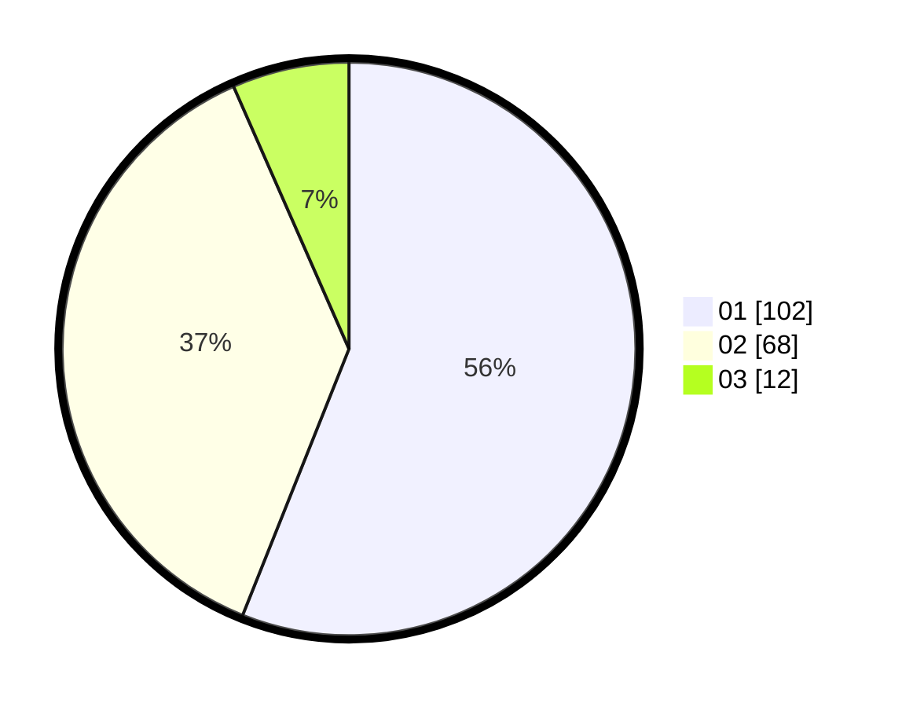

# Hasil

Hasil perolehan suara paslon dapat dilihat pada file paslon-01.txt, paslon-02.txt, dan paslon-03.txt.

Jika tidak ada, artinya data tersebut belum ada pada SIREKAP.

## Perolehan Suara

 * Paslon 01: **102**.
 * Paslon 02: **68**.
 * Paslon 03: **12**.

## Foto C Plano

https://sirekap-obj-formc.kpu.go.id/67cb/pemilu/ppwp/31/71/06/10/02/3171061002044-20240214-234810--3309fe0f-4920-4712-b549-f20bb5874621.jpg

https://sirekap-obj-formc.kpu.go.id/67cb/pemilu/ppwp/31/71/06/10/02/3171061002044-20240215-000730--a5fadaec-b752-4e90-ab11-26a4ee4128cb.jpg

https://sirekap-obj-formc.kpu.go.id/67cb/pemilu/ppwp/31/71/06/10/02/3171061002044-20240215-000813--7c2f3c29-7b0c-4bbb-98e5-33de8f6ca9ee.jpg

## DATA PEMILIH TETAP

Jumlah pemilih dalam DPT: **251**.
 * L: **125**.
 * P: **126**.

## DATA PENGGUNA HAK PILIH

Jumlah pengguna hak pilih dalam DPT: **187**.
 * L: **79**.
 * P: **108**.

Jumlah pengguna hak pilih dalam DPTb: **0**.
 * L: **0**.
 * P: **0**.

Jumlah pengguna hak pilih dalam DPK: **0**.
 * L: **0**.
 * P: **0**.

Jumlah pengguna hak pilih: **187**.
 * L: **79**.
 * P: **108**.

## JUMLAH SUARA SAH DAN TIDAK SAH

JUMLAH SELURUH SUARA SAH: **182**.

JUMLAH SUARA TIDAK SAH: **5**.

JUMLAH SELURUH SUARA SAH DAN SUARA TIDAK SAH: **187**.
