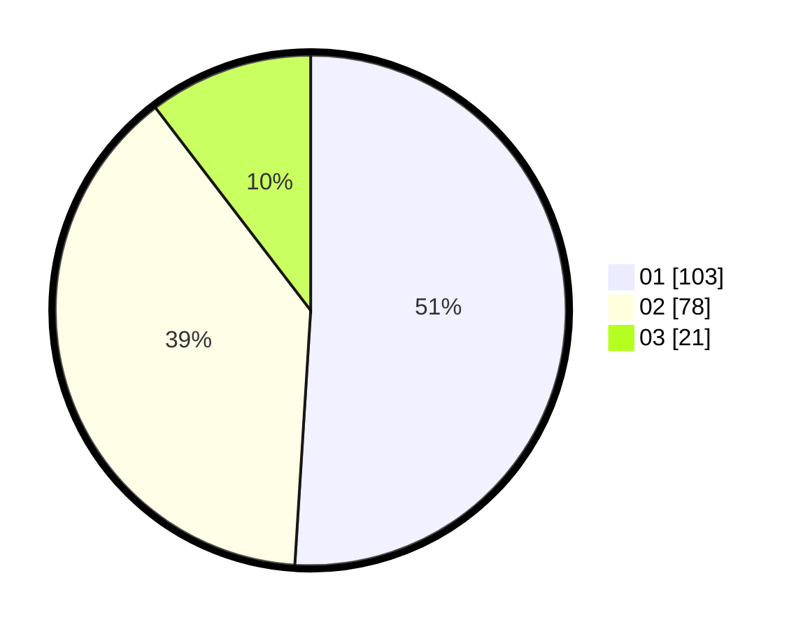

# Hasil

Hasil perolehan suara paslon dapat dilihat pada file paslon-01.txt, paslon-02.txt, dan paslon-03.txt.

Jika tidak ada, artinya data tersebut belum ada pada SIREKAP.

## Perolehan Suara

 * Paslon 01: **103**.
 * Paslon 02: **78**.
 * Paslon 03: **21**.

## Foto C Plano

https://sirekap-obj-formc.kpu.go.id/a348/pemilu/ppwp/31/71/06/10/02/3171061002046-20240215-230140--ea7aaefd-858d-4944-af2b-7b2d7f31e56a.jpg

https://sirekap-obj-formc.kpu.go.id/a348/pemilu/ppwp/31/71/06/10/02/3171061002046-20240215-230141--23613579-92ee-424b-86d5-39b61fc33a25.jpg

https://sirekap-obj-formc.kpu.go.id/a348/pemilu/ppwp/31/71/06/10/02/3171061002046-20240215-230140--4e42f79a-9e05-4cc4-9cf5-1c7641d1d2fb.jpg

## DATA PEMILIH TETAP

Jumlah pemilih dalam DPT: **245**.
 * L: **129**.
 * P: **116**.

## DATA PENGGUNA HAK PILIH

Jumlah pengguna hak pilih dalam DPT: **204**.
 * L: **108**.
 * P: **96**.

Jumlah pengguna hak pilih dalam DPTb: **0**.
 * L: **0**.
 * P: **0**.

Jumlah pengguna hak pilih dalam DPK: **1**.
 * L: **1**.
 * P: **0**.

Jumlah pengguna hak pilih: **205**.
 * L: **109**.
 * P: **96**.

## JUMLAH SUARA SAH DAN TIDAK SAH

JUMLAH SELURUH SUARA SAH: **202**.

JUMLAH SUARA TIDAK SAH: **3**.

JUMLAH SELURUH SUARA SAH DAN SUARA TIDAK SAH: **205**.
