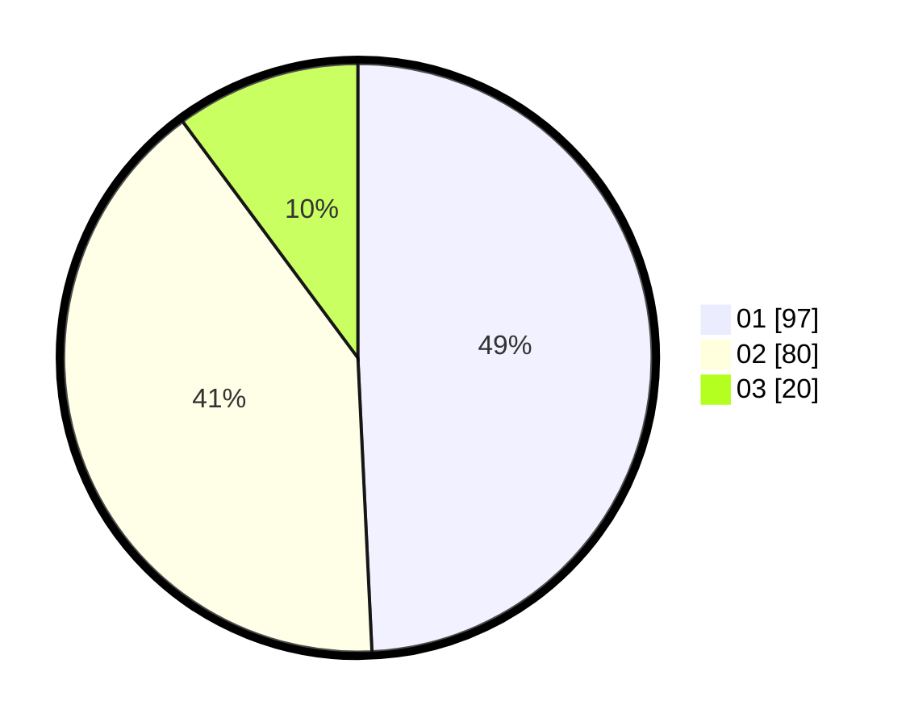

# Hasil

Hasil perolehan suara paslon dapat dilihat pada file paslon-01.txt, paslon-02.txt, dan paslon-03.txt.

Jika tidak ada, artinya data tersebut belum ada pada SIREKAP.

## Perolehan Suara

 * Paslon 01: **97**.
 * Paslon 02: **80**.
 * Paslon 03: **20**.

## Foto C Plano

https://sirekap-obj-formc.kpu.go.id/9c1f/pemilu/ppwp/31/71/06/10/02/3171061002047-20240214-155345--78eaf33d-e73d-498d-b050-f372475d82b2.jpg

https://sirekap-obj-formc.kpu.go.id/9c1f/pemilu/ppwp/31/71/06/10/02/3171061002047-20240214-155316--0dbd3471-9a65-40f6-9181-32595e72043a.jpg

https://sirekap-obj-formc.kpu.go.id/9c1f/pemilu/ppwp/31/71/06/10/02/3171061002047-20240214-155408--cd5915a8-8485-4931-a39a-21ce748dde40.jpg

## DATA PEMILIH TETAP

Jumlah pemilih dalam DPT: **242**.
 * L: **131**.
 * P: **111**.

## DATA PENGGUNA HAK PILIH

Jumlah pengguna hak pilih dalam DPT: **200**.
 * L: **113**.
 * P: **87**.

Jumlah pengguna hak pilih dalam DPTb: **4**.
 * L: **2**.
 * P: **2**.

Jumlah pengguna hak pilih dalam DPK: **0**.
 * L: **0**.
 * P: **0**.

Jumlah pengguna hak pilih: **204**.
 * L: **115**.
 * P: **89**.

## JUMLAH SUARA SAH DAN TIDAK SAH

JUMLAH SELURUH SUARA SAH: **197**.

JUMLAH SUARA TIDAK SAH: **7**.

JUMLAH SELURUH SUARA SAH DAN SUARA TIDAK SAH: **204**.
