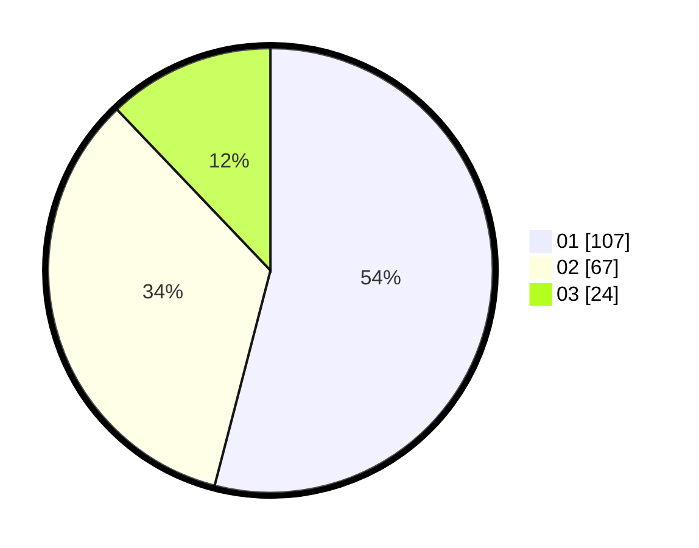

# Hasil

Hasil perolehan suara paslon dapat dilihat pada file paslon-01.txt, paslon-02.txt, dan paslon-03.txt.

Jika tidak ada, artinya data tersebut belum ada pada SIREKAP.

## Perolehan Suara

 * Paslon 01: **107**.
 * Paslon 02: **67**.
 * Paslon 03: **24**.

## Foto C Plano

https://sirekap-obj-formc.kpu.go.id/2113/pemilu/ppwp/31/71/06/10/02/3171061002048-20240214-214135--d0c58d05-9e68-4f43-be6b-084f2f2f81b1.jpg

https://sirekap-obj-formc.kpu.go.id/2113/pemilu/ppwp/31/71/06/10/02/3171061002048-20240214-214438--cc8ec46f-28cb-4e16-8312-0fa09ab38cc5.jpg

https://sirekap-obj-formc.kpu.go.id/2113/pemilu/ppwp/31/71/06/10/02/3171061002048-20240214-214539--7e0df568-bd03-45ab-a0fa-3608230f1ea5.jpg

## DATA PEMILIH TETAP

Jumlah pemilih dalam DPT: **248**.
 * L: **122**.
 * P: **126**.

## DATA PENGGUNA HAK PILIH

Jumlah pengguna hak pilih dalam DPT: **201**.
 * L: **99**.
 * P: **102**.

Jumlah pengguna hak pilih dalam DPTb: **1**.
 * L: **1**.
 * P: **0**.

Jumlah pengguna hak pilih dalam DPK: **0**.
 * L: **0**.
 * P: **0**.

Jumlah pengguna hak pilih: **202**.
 * L: **100**.
 * P: **102**.

## JUMLAH SUARA SAH DAN TIDAK SAH

JUMLAH SELURUH SUARA SAH: **198**.

JUMLAH SUARA TIDAK SAH: **4**.

JUMLAH SELURUH SUARA SAH DAN SUARA TIDAK SAH: **202**.
