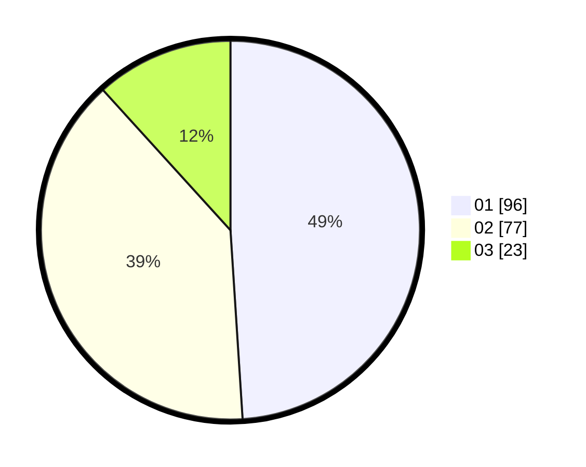

# Hasil

Hasil perolehan suara paslon dapat dilihat pada file paslon-01.txt, paslon-02.txt, dan paslon-03.txt.

Jika tidak ada, artinya data tersebut belum ada pada SIREKAP.

## Perolehan Suara

 * Paslon 01: **96**.
 * Paslon 02: **77**.
 * Paslon 03: **23**.

## Foto C Plano

https://sirekap-obj-formc.kpu.go.id/09b2/pemilu/ppwp/31/71/06/10/02/3171061002055-20240214-223852--a1d630fb-85c9-4b45-a10f-5d87e9a54937.jpg

https://sirekap-obj-formc.kpu.go.id/09b2/pemilu/ppwp/31/71/06/10/02/3171061002055-20240214-224003--8b445c6c-9cea-465a-99b9-482109251779.jpg

https://sirekap-obj-formc.kpu.go.id/09b2/pemilu/ppwp/31/71/06/10/02/3171061002055-20240214-224122--89cc5446-cc1b-4ff1-b714-683b6006ceb8.jpg

## DATA PEMILIH TETAP

Jumlah pemilih dalam DPT: **262**.
 * L: **125**.
 * P: **137**.

## DATA PENGGUNA HAK PILIH

Jumlah pengguna hak pilih dalam DPT: **197**.
 * L: **90**.
 * P: **107**.

Jumlah pengguna hak pilih dalam DPTb: **4**.
 * L: **3**.
 * P: **1**.

Jumlah pengguna hak pilih dalam DPK: **0**.
 * L: **0**.
 * P: **0**.

Jumlah pengguna hak pilih: **201**.
 * L: **93**.
 * P: **108**.

## JUMLAH SUARA SAH DAN TIDAK SAH

JUMLAH SELURUH SUARA SAH: **196**.

JUMLAH SUARA TIDAK SAH: **5**.

JUMLAH SELURUH SUARA SAH DAN SUARA TIDAK SAH: **201**.
