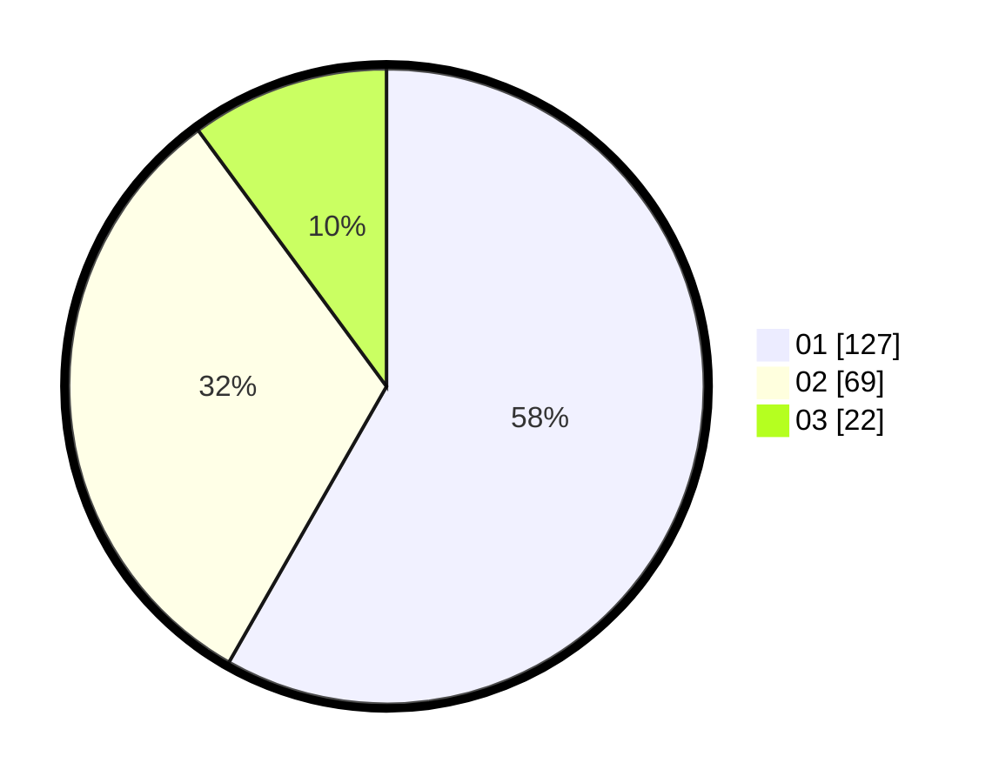

# Hasil

Hasil perolehan suara paslon dapat dilihat pada file paslon-01.txt, paslon-02.txt, dan paslon-03.txt.

Jika tidak ada, artinya data tersebut belum ada pada SIREKAP.

## Perolehan Suara

 * Paslon 01: **127**.
 * Paslon 02: **69**.
 * Paslon 03: **22**.

## Foto C Plano

https://sirekap-obj-formc.kpu.go.id/7f8c/pemilu/ppwp/31/71/06/10/02/3171061002058-20240215-011102--39e5ff56-fdcb-42b1-bdc4-46eaf02fa3d0.jpg

https://sirekap-obj-formc.kpu.go.id/7f8c/pemilu/ppwp/31/71/06/10/02/3171061002058-20240216-091131--42c5064e-9cde-419c-a7f4-635c31e9e866.jpg

https://sirekap-obj-formc.kpu.go.id/7f8c/pemilu/ppwp/31/71/06/10/02/3171061002058-20240215-022145--0f44c2d1-f067-4cb7-8c08-a57f9d96d132.jpg

## DATA PEMILIH TETAP

Jumlah pemilih dalam DPT: **276**.
 * L: **133**.
 * P: **143**.

## DATA PENGGUNA HAK PILIH

Jumlah pengguna hak pilih dalam DPT: **221**.
 * L: **107**.
 * P: **114**.

Jumlah pengguna hak pilih dalam DPTb: **3**.
 * L: **0**.
 * P: **3**.

Jumlah pengguna hak pilih dalam DPK: **0**.
 * L: **0**.
 * P: **0**.

Jumlah pengguna hak pilih: **224**.
 * L: **107**.
 * P: **117**.

## JUMLAH SUARA SAH DAN TIDAK SAH

JUMLAH SELURUH SUARA SAH: **218**.

JUMLAH SUARA TIDAK SAH: **6**.

JUMLAH SELURUH SUARA SAH DAN SUARA TIDAK SAH: **224**.
