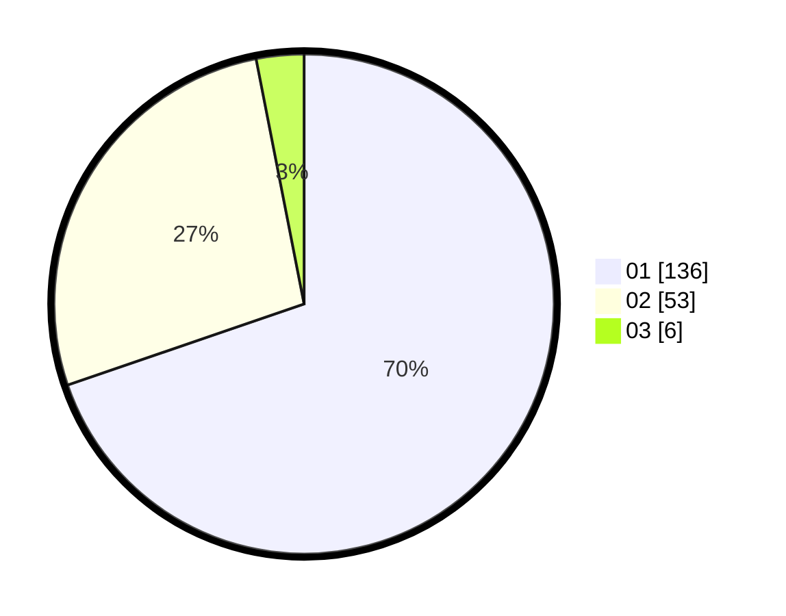

# Hasil

Hasil perolehan suara paslon dapat dilihat pada file paslon-01.txt, paslon-02.txt, dan paslon-03.txt.

Jika tidak ada, artinya data tersebut belum ada pada SIREKAP.

## Perolehan Suara

 * Paslon 01: **136**.
 * Paslon 02: **53**.
 * Paslon 03: **6**.

## Foto C Plano

https://sirekap-obj-formc.kpu.go.id/ee02/pemilu/ppwp/31/71/06/10/02/3171061002059-20240214-194822--1b725e12-c614-4cea-8051-90c2eaf80db5.jpg

https://sirekap-obj-formc.kpu.go.id/ee02/pemilu/ppwp/31/71/06/10/02/3171061002059-20240214-223809--28e8d905-0f01-4fc1-a7e9-8eb7e0f1b891.jpg

https://sirekap-obj-formc.kpu.go.id/ee02/pemilu/ppwp/31/71/06/10/02/3171061002059-20240214-225216--e11f4ff1-e9a1-4ea0-8dfd-8ce3ef9bb1b8.jpg

## DATA PEMILIH TETAP

Jumlah pemilih dalam DPT: **252**.
 * L: **121**.
 * P: **131**.

## DATA PENGGUNA HAK PILIH

Jumlah pengguna hak pilih dalam DPT: **202**.
 * L: **93**.
 * P: **109**.

Jumlah pengguna hak pilih dalam DPTb: **1**.
 * L: **0**.
 * P: **1**.

Jumlah pengguna hak pilih dalam DPK: **0**.
 * L: **0**.
 * P: **0**.

Jumlah pengguna hak pilih: **203**.
 * L: **93**.
 * P: **110**.

## JUMLAH SUARA SAH DAN TIDAK SAH

JUMLAH SELURUH SUARA SAH: **195**.

JUMLAH SUARA TIDAK SAH: **8**.

JUMLAH SELURUH SUARA SAH DAN SUARA TIDAK SAH: **203**.
