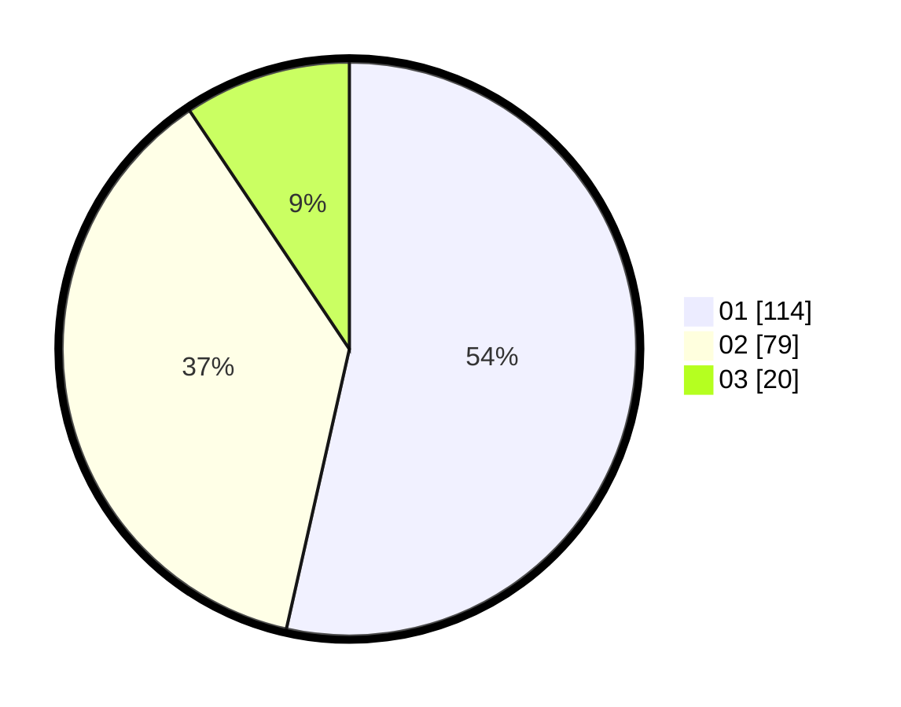

# Hasil

Hasil perolehan suara paslon dapat dilihat pada file paslon-01.txt, paslon-02.txt, dan paslon-03.txt.

Jika tidak ada, artinya data tersebut belum ada pada SIREKAP.

## Perolehan Suara

 * Paslon 01: **114**.
 * Paslon 02: **79**.
 * Paslon 03: **20**.

## Foto C Plano

https://sirekap-obj-formc.kpu.go.id/6bb8/pemilu/ppwp/31/71/06/10/02/3171061002060-20240214-204947--105cc642-b6be-4c69-99c6-a289d37d4bab.jpg

https://sirekap-obj-formc.kpu.go.id/6bb8/pemilu/ppwp/31/71/06/10/02/3171061002060-20240214-203302--bc1644fe-946a-4223-9a59-23ae9215ffab.jpg

https://sirekap-obj-formc.kpu.go.id/6bb8/pemilu/ppwp/31/71/06/10/02/3171061002060-20240214-232607--523e914e-c9f8-48c3-abb1-cf05e4e708e5.jpg

## DATA PEMILIH TETAP

Jumlah pemilih dalam DPT: **275**.
 * L: **137**.
 * P: **138**.

## DATA PENGGUNA HAK PILIH

Jumlah pengguna hak pilih dalam DPT: **212**.
 * L: **100**.
 * P: **112**.

Jumlah pengguna hak pilih dalam DPTb: **212**.
 * L: **100**.
 * P: **112**.

Jumlah pengguna hak pilih dalam DPK: **1**.
 * L: **1**.
 * P: **0**.

Jumlah pengguna hak pilih: **214**.
 * L: **102**.
 * P: **112**.

## JUMLAH SUARA SAH DAN TIDAK SAH

JUMLAH SELURUH SUARA SAH: **213**.

JUMLAH SUARA TIDAK SAH: **1**.

JUMLAH SELURUH SUARA SAH DAN SUARA TIDAK SAH: **214**.
