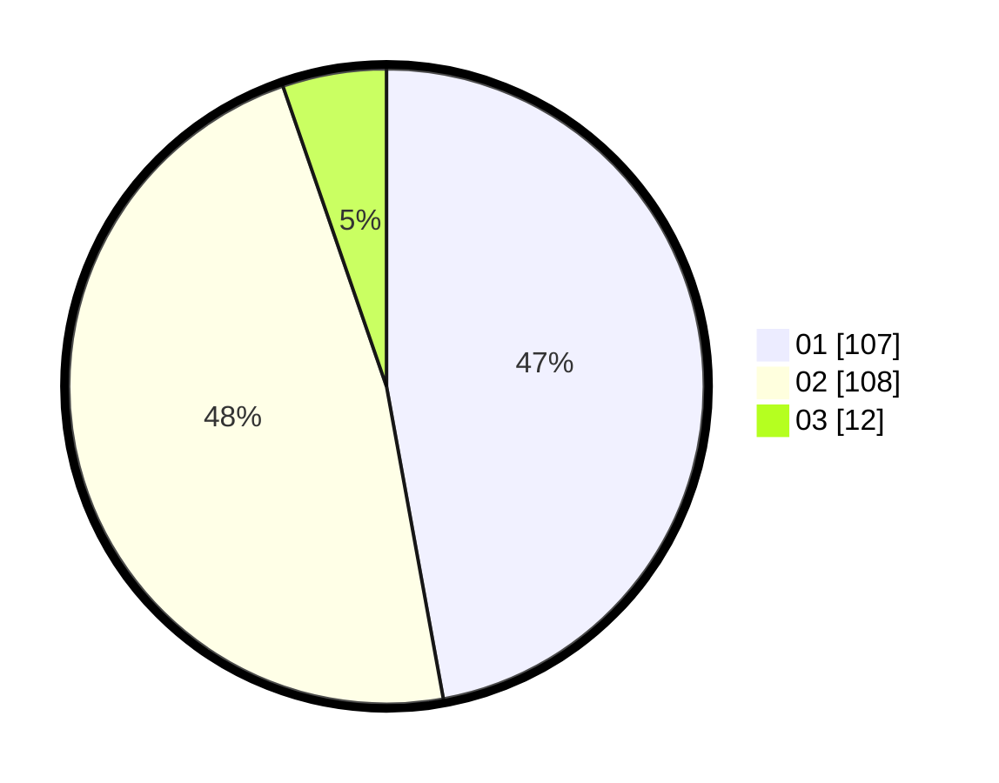

# Hasil

Hasil perolehan suara paslon dapat dilihat pada file paslon-01.txt, paslon-02.txt, dan paslon-03.txt.

Jika tidak ada, artinya data tersebut belum ada pada SIREKAP.

## Perolehan Suara

 * Paslon 01: **107**.
 * Paslon 02: **108**.
 * Paslon 03: **12**.

## Foto C Plano

https://sirekap-obj-formc.kpu.go.id/8a84/pemilu/ppwp/31/71/06/10/02/3171061002065-20240214-211906--f4531816-594e-443f-b22f-8194170a117c.jpg

https://sirekap-obj-formc.kpu.go.id/8a84/pemilu/ppwp/31/71/06/10/02/3171061002065-20240214-212314--02ce69b2-9455-4584-ae8d-97df049e99fe.jpg

https://sirekap-obj-formc.kpu.go.id/8a84/pemilu/ppwp/31/71/06/10/02/3171061002065-20240214-212415--7f13d231-1c48-47b5-97a5-7c80a6252d84.jpg

## DATA PEMILIH TETAP

Jumlah pemilih dalam DPT: **279**.
 * L: **142**.
 * P: **137**.

## DATA PENGGUNA HAK PILIH

Jumlah pengguna hak pilih dalam DPT: **228**.
 * L: **115**.
 * P: **113**.

Jumlah pengguna hak pilih dalam DPTb: **3**.
 * L: **1**.
 * P: **2**.

Jumlah pengguna hak pilih dalam DPK: **1**.
 * L: **1**.
 * P: **0**.

Jumlah pengguna hak pilih: **232**.
 * L: **117**.
 * P: **115**.

## JUMLAH SUARA SAH DAN TIDAK SAH

JUMLAH SELURUH SUARA SAH: **227**.

JUMLAH SUARA TIDAK SAH: **5**.

JUMLAH SELURUH SUARA SAH DAN SUARA TIDAK SAH: **232**.
