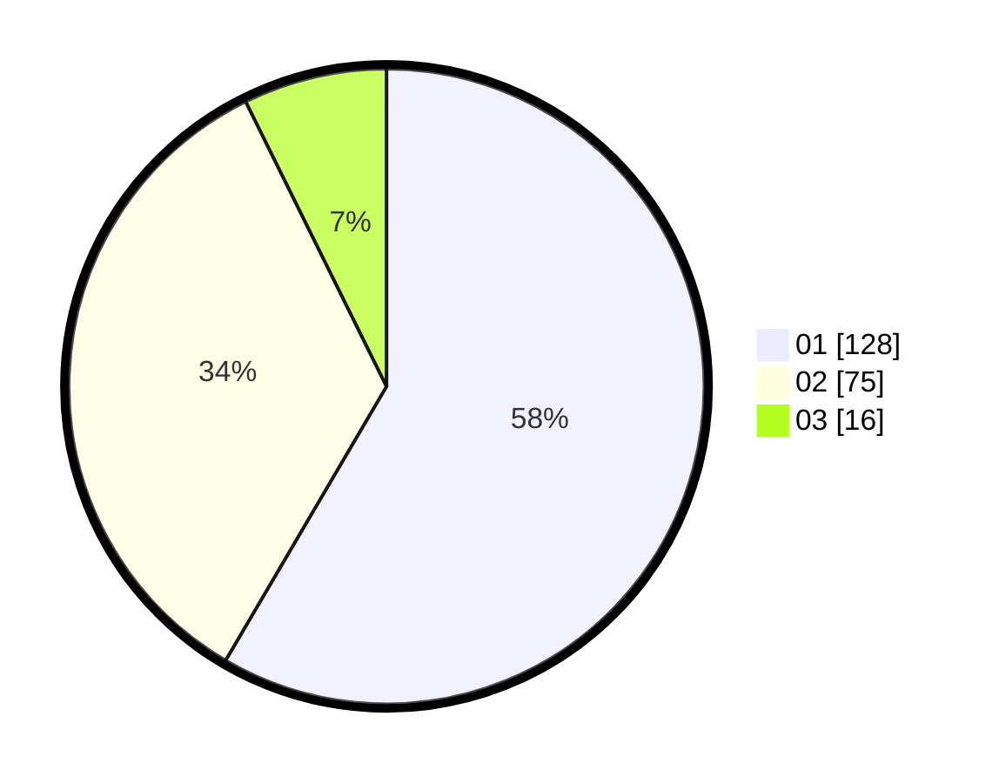

# Hasil

Hasil perolehan suara paslon dapat dilihat pada file paslon-01.txt, paslon-02.txt, dan paslon-03.txt.

Jika tidak ada, artinya data tersebut belum ada pada SIREKAP.

## Perolehan Suara

 * Paslon 01: **128**.
 * Paslon 02: **75**.
 * Paslon 03: **16**.

## Foto C Plano

https://sirekap-obj-formc.kpu.go.id/2c0e/pemilu/ppwp/31/71/06/10/02/3171061002066-20240215-072818--c4432fb2-83a9-4802-9cf6-d22e503e2edf.jpg

https://sirekap-obj-formc.kpu.go.id/2c0e/pemilu/ppwp/31/71/06/10/02/3171061002066-20240215-060538--a3b1e3b4-da73-466d-9d16-060f6f14e0d6.jpg

https://sirekap-obj-formc.kpu.go.id/2c0e/pemilu/ppwp/31/71/06/10/02/3171061002066-20240215-061546--2a6ff3ae-b662-4f53-919c-9586396c4245.jpg

## DATA PEMILIH TETAP

Jumlah pemilih dalam DPT: **280**.
 * L: **136**.
 * P: **144**.

## DATA PENGGUNA HAK PILIH

Jumlah pengguna hak pilih dalam DPT: **280**.
 * L: **136**.
 * P: **144**.

Jumlah pengguna hak pilih dalam DPTb: **3**.
 * L: **2**.
 * P: **1**.

Jumlah pengguna hak pilih dalam DPK: **0**.
 * L: **0**.
 * P: **0**.

Jumlah pengguna hak pilih: **283**.
 * L: **138**.
 * P: **145**.

## JUMLAH SUARA SAH DAN TIDAK SAH

JUMLAH SELURUH SUARA SAH: **219**.

JUMLAH SUARA TIDAK SAH: **2**.

JUMLAH SELURUH SUARA SAH DAN SUARA TIDAK SAH: **221**.
