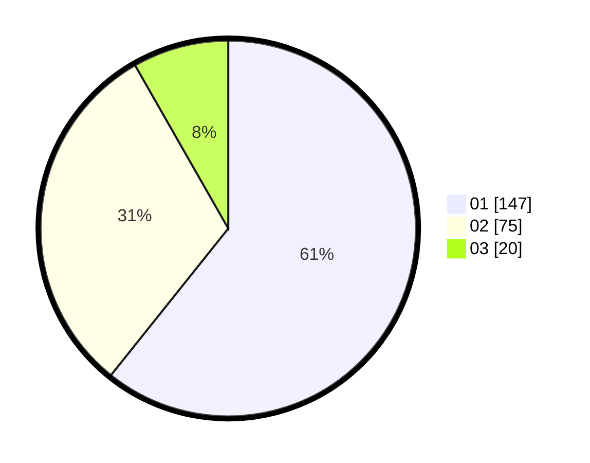

# Hasil

Hasil perolehan suara paslon dapat dilihat pada file paslon-01.txt, paslon-02.txt, dan paslon-03.txt.

Jika tidak ada, artinya data tersebut belum ada pada SIREKAP.

## Perolehan Suara

 * Paslon 01: **147**.
 * Paslon 02: **75**.
 * Paslon 03: **20**.

## Foto C Plano

https://sirekap-obj-formc.kpu.go.id/62f5/pemilu/ppwp/31/71/06/10/02/3171061002069-20240216-094806--fe071ff7-d385-43f7-81f6-5fe4c17af367.jpg

https://sirekap-obj-formc.kpu.go.id/62f5/pemilu/ppwp/31/71/06/10/02/3171061002069-20240216-094808--8ef41b56-40fa-4d57-85fd-dbf6919a23c6.jpg

https://sirekap-obj-formc.kpu.go.id/62f5/pemilu/ppwp/31/71/06/10/02/3171061002069-20240216-094807--e443b8d5-21a6-4136-96b2-9ae405fb7a51.jpg

## DATA PEMILIH TETAP

Jumlah pemilih dalam DPT: **293**.
 * L: **140**.
 * P: **153**.

## DATA PENGGUNA HAK PILIH

Jumlah pengguna hak pilih dalam DPT: **236**.
 * L: **107**.
 * P: **129**.

Jumlah pengguna hak pilih dalam DPTb: **4**.
 * L: **1**.
 * P: **3**.

Jumlah pengguna hak pilih dalam DPK: **3**.
 * L: **1**.
 * P: **2**.

Jumlah pengguna hak pilih: **243**.
 * L: **109**.
 * P: **134**.

## JUMLAH SUARA SAH DAN TIDAK SAH

JUMLAH SELURUH SUARA SAH: **242**.

JUMLAH SUARA TIDAK SAH: **1**.

JUMLAH SELURUH SUARA SAH DAN SUARA TIDAK SAH: **243**.
